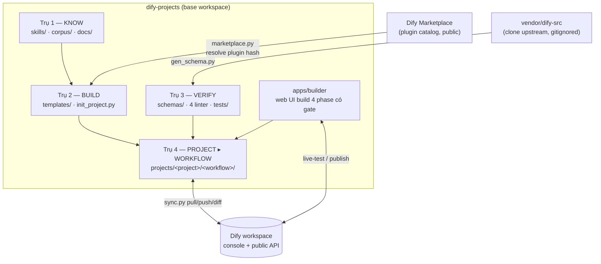
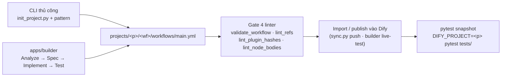

# Architecture

Thiết kế chi tiết của `dify-projects` — base workspace cho dự án Dify.

## Mục tiêu

Workspace này nhắm tới việc giảm friction khi:
- Build YAML workflow mới (mỗi project lặp lại 80% steps)
- Maintain prompt/code version (Dify built-in version control yếu)
- Test workflow đã deploy (Dify chưa có test framework)
- Onboarding dev mới (mỗi project có convention riêng)

Không phải mục tiêu (sẽ làm sau hoặc không bao giờ):
- Replace Dify UI editor
- Host Dify (đã có docker-compose của upstream)
- Train custom models

## 4 trụ cột (+ 1 app)



### Trụ 1 — Know (`skills/`, `corpus/`, `docs/`)
Knowledge base read-only. 3 Claude skills + 1 community corpus.
- **Tại sao cần**: Dify DSL không có official spec; phải reverse-engineer.
- **Update strategy**: re-clone khi upstream cập nhật. Gitignored để base repo nhẹ.

### Trụ 2 — Build (`templates/`, `tools/dify_base/init_project.py`)
Scaffolder + reusable patterns.
- `_base/project/` → cookiecutter target cho mỗi project mới.
- `patterns/` → 10 workflow skeletons phổ biến (file-to-llm, file-iteration, multi-step-llm, rag-qa, agent-with-tools, per-row-notify, per-row-notify-excel, scheduled-fetch-notify, scheduled-tool-append, meta-workflow-builder).
- `library/` → curated templates promote từ corpus, provenance-stamped (gate: `tools/dify_base/promote_gate.py` — spec 050 D3; tầng library promotion: spec 022 D5).
- `probes/` → workflow probe chạy trong workspace đích (`stdlib_check.yml` — dò module sandbox).
- `init_project.py` → CLI interactive prompt 6 câu, copy + substitute; `--kind project|workflow` scaffold từng tầng (spec 030).

### Trụ 3 — Verify (`schemas/`, `tools/dify_base/lint_*`, `tests/`)
JSON Schema cho DSL + bộ linter + pytest harness.
- `gen_schema.py` → reverse-engineer pydantic models từ `vendor/dify-src/` (clone upstream, gitignored) → JSON Schema Draft-7.
- Bộ 4 linter (đồng thời là gate ③ của Builder, spec 038): `validate_workflow.py` + `lint_refs.py` + `lint_plugin_hashes.py` + `lint_node_bodies.py` (kèm `--dump-schema <node-type>` để xem body schema của một node).
- VS Code wire qua `.vscode/settings.json` (regen: `scripts/regen_vscode_settings.py`) → autocomplete + lint trong editor.
- Pre-commit (`.pre-commit-config.yaml`) chạy lại đúng các check trên cho mỗi commit.
- `tests/conftest.py` → `DifyWorkflowClient` minimal (~100 LOC) + env-loader fixture.
- `tests/` → phần lớn là self-test cho toolkit (lint/sync/provenance/docs-drift…); 2 file chạy live trên Dify thật với syrupy snapshot (`test_workflow_smoke.py`, `test_e2e_check.py`) — skip khi thiếu creds.

### Trụ 4 — Project ▸ Workflow (`projects/`, spec 030)
Hệ thống 2 tầng thật trên đĩa: 1 Project là 1 thư mục chứa nhiều Workflow con.
Tầng Project scaffold từ `templates/_base/project/`, tầng Workflow từ `templates/_base/workflow/`:
```
projects/<project>/
├── .dify-workspace.yaml   # PROJECT manifest (name + env → workspace URL mapping) — dùng chung
├── envs/                  # dev.env (gitignored) — creds Dify DÙNG CHUNG cho mọi workflow
├── README.md
├── <workflow>/            # 1 Workflow (thư mục con)
│   ├── workflows/         # Dify YAML (main.yml)
│   ├── SPEC.md
│   ├── prompts/           # Externalized prompts
│   ├── inputs/            # Sample/fixture data
│   └── tests/fixtures/    # JSON test fixtures
└── <workflow_2>/ …
```
`projects/_drafts/` là project dành riêng cho các build "loose" (New task không chọn project).

### App — Builder (`apps/builder`)
Web UI (Fastify + Preact SPA) chạy build 4 phase có gate (Analyze → Spec → Implement → Test) trên chính 4 trụ trên; toolchain TS/Node riêng, pre-commit và pytest của repo bỏ qua `apps/`. Không mô tả lại cơ chế ở đây — chi tiết: [AGENTS.md §10](../AGENTS.md) + bộ doc hiện trạng [docs/state/](state/README.md).

## Workflow end-to-end

Hai đường authoring (CLI thủ công / Builder) hội tụ về cùng bộ gate và test:



Các bước thủ công đầy đủ:

```
1. Scaffold project:
      python3 tools/dify_base/init_project.py
      → projects/my_app/

2. Scaffold workflow trong project:
      .venv/bin/python tools/dify_base/init_project.py --kind workflow --project my_app --slug my_wf
      → projects/my_app/my_wf/

3. Pick pattern:
      python3 tools/dify_base/find.py --has iteration --has file-input
      cp templates/patterns/file-iteration.yml projects/my_app/my_wf/workflows/main.yml

4. Edit (VS Code autocomplete from JSON Schema):
      # Look for `# TODO:` markers
      # Replace plugin hashes from your target Dify workspace
      # Configure model provider+name

5. Validate:
      python3 tools/dify_base/validate_workflow.py projects/my_app/my_wf/workflows/main.yml

6. Import vào Dify workspace → copy app API key.

7. Fill creds:
      cp projects/my_app/envs/dev.env.example projects/my_app/envs/dev.env
      # Edit DIFY_BASE_URL (with /v1 suffix), DIFY_API_KEY

8. Test:
      DIFY_PROJECT=my_app .venv/bin/pytest tests/ --snapshot-update
```

## Phase roadmap

| Phase | Status | Output |
|---|---|---|
| 0 | ✅ | Base structure, git init, skills cloned |
| 1.A | ✅ | `schemas/gen_schema.py` + JSON Schema envelope (29 NodeData reference defs; node bodies not schema-enforced) |
| 1.B | ✅ | `init_project.py` + `_base/project/` skeleton |
| 1.C | ✅ | 14 patterns trong `templates/patterns/` |
| 1.D | ✅ | pytest harness via custom DifyWorkflowClient |
| 2.A | ✅ | GitOps sync: `sync.py pull/push/diff` workspace ↔ git (nay thêm `list/models/plugins/datasets/api-key/publish/delete` phục vụ Builder live-test) |
| 2.B | ✅ | pre-commit hook (yamllint + schema check) |
| 2.C | ⏳ | `.devcontainer/` cho VS Code |
| Builder | ✅ | `apps/builder` — web UI build 4 phase có gate: turn sandbox, 4-linter gate, live-test trên Dify thật, Ask mode, template library + promote-to-pattern, upload-YAML-as-base, retry/edit-again. Đợt dọn 2026-07-17 retire 71 spec (trong 77 file spec, có số trùng — đọc: `git show ca5e39e:docs/specs/`); các spec còn mở lúc đó cũng đã xử lý xong sau đợt dọn — `docs/specs/` hiện chỉ còn spec mở từ 071. Chi tiết: AGENTS.md §10 + `docs/state/` |
| Polish | ⏳ | Fix `http_request` schema-dump (`_error: SchemaSerializer` — spec 024 S1 đã retire, việc vẫn mở); `agent` already dumps clean — 25/25 node modules import |
| Future | ⏳ | Prompt flatten/unflatten (split `.prompt.md` from YAML) |

## Tradeoffs đã chọn

| Vấn đề | Lựa chọn | Lý do |
|---|---|---|
| dify-python-sdk | Tự viết minimal client (~100 LOC) | PyPI version thiếu WorkflowClient; pin git revision fragile |
| Pydantic dep installation | Auto-stub heavy deps (động, tự tạo stub khi import thiếu) | Chỉ cần extract schemas; installing tất cả mất 5+ phút |
| Project location | `projects/` inside base | Monorepo-style; 1 venv, 1 schema, 1 toolkit |
| Skills storage | Git clone, gitignored | Update upstream tự do; base repo nhẹ |
| Schema version | 0.6.0 (pin ở `.dify-dsl-version`, extract từ `vendor/dify-src`) | Match upstream `CURRENT_DSL_VERSION` constant |
| Test strategy | Run against real Dify (skip without creds) | Mock-LLM phức tạp, real test catches integration bugs |

## Decisions cần review sau

1. **DSL version policy**: nếu Dify ra v1.x với DSL bumped, làm sao mass-migrate templates? — Phase 2+
2. **Plugin hash management**: ✅ đã giải — `tools/dify_base/marketplace.py` resolve hash từ marketplace catalog (public, version-keyed), `lint_plugin_hashes.py` giữ format. Còn mở: dataset id vẫn workspace-local, không có nguồn public.
3. **Project-local vs base-shared venv**: hiện base `.venv/` shared cho mọi project. Nếu project có deps riêng (test fixtures import lib X) thì cần venv-per-project. — Phase 2+
4. **Multi-env GitOps**: `sync.py` đã ship (2.A ✅) nhưng manifest mới khai báo `dev`; staging/prod sync vẫn mở.
