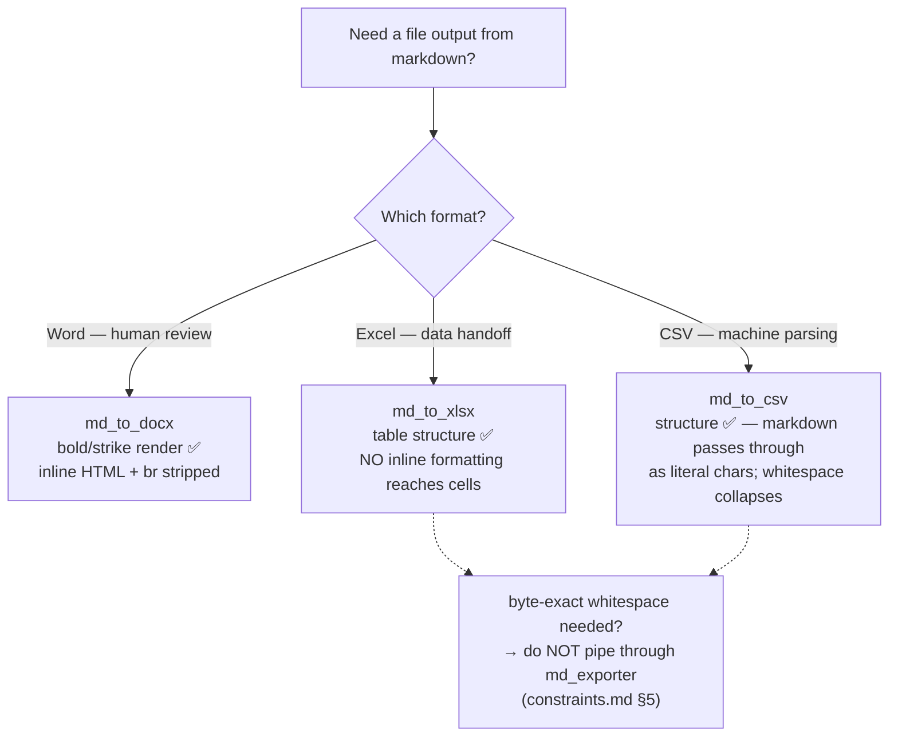

# Plugin Capabilities

Observed behaviors of Dify marketplace plugins used across projects in this
base. The goal: when a project picks a plugin tool, the maintainer can look
here first instead of writing a one-off test workflow to learn whether bold
markdown survives, whether ` ` is stripped, etc.

> **This file is not auto-generated.** Add a row when you verify a plugin
> tool's behavior in a project. Link back to the test workflow YAML that
> established the verification, so future readers can re-run and confirm.

## Format

Per plugin: one `## <provider>/<plugin> v<X.Y.Z>` heading + one table listing
tools and observed behavior per format/feature column. Marks:

- ✅ — works as expected, formatting preserved or rendered
- ❌ — does not work / strips silently / errors
- ⚠️ — partial, see Notes column for details (e.g. literal pass-through)
- ❓ — not tested in this repo; next project that exercises this cell should
  fill it in and add the test workflow link

Untested cells stay `❓`. Don't guess — leaving a cell `❓` is honest and
invites the next probe; flipping it to ✅ without a verification link is the
failure mode this file exists to prevent.

## `bowenliang123/md_exporter` v2.1.1

Verifications captured 2026-05-21 from the `projects/eiken_stem_proofread/workflows/` test workflows.
Columns describe how each tool handles inline markdown / HTML / line-break tokens inside table cells.

> **Note (2026-07-03):** the `eiken_stem_proofread` probe workflows linked below
> (`test_docx_highlight.yml`, `test_xlsx_highlight.yml`, `test_openpyxl_feasibility.yml`) were
> **removed** from the tree — the verified findings in these tables stand, but the links are dead.
> **Do not chase those paths** (history: `git show 565480c^:projects/eiken_stem_proofread/workflows/<file>`).
> For the correct `md_to_xlsx` **tool-node YAML shape**, see
> [runtime-supplement.md → `md_to_xlsx` tool node](runtime-supplement.md).

| Tool         | `**bold**` | `~~strike~~`    | inline `` HTML | ` `       | Tables          | Notes |
|--------------|------------|-----------------|----------------------|--------------|-----------------|-------|
| md_to_docx   | ✅         | ✅              | ❌ stripped          | ❌ stripped  | ✅              | Best for human visual review; inline formatting renders in Word. Verified via `test_docx_highlight.yml` (removed — see the note above; view via `git show`). |
| md_to_xlsx   | ❌ stripped | ⚠️ literal `~~` | ❌ stripped          | ❌ stripped  | ✅ structure    | No inline formatting reaches Excel cells. Whitespace also collapses (see [constraints.md §5](../skills/mango-svip/references/constraints.md)). Verified via `test_xlsx_highlight.yml` (removed — see the note above; view via `git show`). |
| md_to_csv    | ⚠️ literal | ⚠️ literal      | ⚠️ literal           | ⚠️ literal   | ✅ structure    | CSV is plain text — markdown syntax passes through as literal characters in cells (`**bold**` appears as `**bold**`). Whitespace collapses (see [constraints.md §5](../skills/mango-svip/references/constraints.md)). |
| md_to_html   | ❓         | ❓              | ❓ likely pass-through | ❓         | ❓              | Untested. Likely pass-through given the format. |
| md_to_pdf    | ❓         | ❓              | ❓                   | ❓           | ❓              | Untested. |
| md_to_md     | ❓         | ❓              | ❓                   | ❓           | ❓              | Untested. |
| md_to_json   | ❓         | ❓              | ❓                   | ❓           | ❓              | Untested. |
| md_to_latex  | ❓         | ❓              | ❓                   | ❓           | ❓              | Untested. |
| md_to_xml    | ❓         | ❓              | ❓                   | ❓           | ❓              | Untested. |

> **Tool inventory note (v3.6.9 catalog):** the current `templates/tool-catalog.json` lists 14 tools
> for this plugin; `md_to_yaml`/`md_to_typst` (previously listed here) are **not** among them and were
> dropped from the table. Additional v3.6.9 tools not yet in the matrix (all untested): `md_to_pptx`,
> `md_to_ipynb`, `md_to_html_text`, `md_to_png`, `md_to_codeblock`.

### Picking an export tool (from the verified cells above)

### Operational notes

- **Whitespace collapse** affects all `md_to_*` tools that emit text-bearing
  cell formats (`csv`, `xlsx`, …). Documented separately in
  [constraints.md §5](../skills/mango-svip/references/constraints.md) since
  it's a plugin-wide concern, not per-tool.
- **Inline HTML stripping** (docx, xlsx) means you cannot smuggle styling via
  ``. If you need cell-level coloring or font, the
  plugin's own markdown features (`**bold**` for docx) are the only path —
  for xlsx, the plugin has no rich-text equivalent (see
  `test_openpyxl_feasibility.yml` — removed, view via `git show 565480c^:projects/eiken_stem_proofread/workflows/test_openpyxl_feasibility.yml` —
  for the alternative-path investigation).
- **Plugin hash** is public and **version**-keyed — resolve it, never invent it
  (see [AGENTS.md §4.3](../AGENTS.md) / spec 067 — retired 2026-07-17, view via
  `git show ca5e39e:docs/specs/067-tool-nodes-are-buildable.md`).
  *(This line previously said "workspace-specific"; that was the retired myth.)* The version above
  (v2.1.1) is the version eiken verified against; tool behavior may differ on other versions — and
  because the hash is keyed to the version, an upgrade means **re-resolving** the hash, not
  re-exporting a YAML. As of the catalog's `resolved_on` (2026-07-17), `templates/tool-catalog.json` resolves
  `bowenliang123/md_exporter` at **v3.6.9** — the table above has NOT been re-verified on it.

## `omluc/google_sheets` — write semantics

The catalog exposes `batch_get` (read) and `batch_update` (write) — **no `append` primitive.**
`batch_update` writes to the range carried inside its `data` param (Google's `[{range, values}]`
form); a range like `記録!A:D` writes **from A1**, i.e. OVERWRITES existing rows. So a workflow that
must ACCUMULATE rows ("記録して月末に見返す") cannot just call `batch_update` with a fixed range — it
must first `batch_get` the current row count and target `A{n+1}`. A build that gets this right reads
then writes (`rng = "A" + str(existing + 1)`); a build that writes `A:D` will silently overwrite.
(Not yet verified live whether the plugin itself appends despite the range — the theory above is from
the Google Sheets API + reading real builds; confirm with one live run before trusting accumulation.)

## Cross-references

- [AGENTS.md](../AGENTS.md) — repo conventions; §4.3 plugin hash, §8 doc index
- [constraints.md](../skills/mango-svip/references/constraints.md) — runtime
  constraints including §5 (md_exporter whitespace) and §10 (common output
  schemas including the Tool node output shape)
- Source verifications (eiken — **removed from the tree 2026-07-03**, links are history-only;
  view via `git show 565480c^:projects/eiken_stem_proofread/workflows/<file>`):
  - `test_docx_highlight.yml` · `test_xlsx_highlight.yml` · `test_openpyxl_feasibility.yml`

## Adding a new plugin

1. Use the plugin in a real project workflow.
2. Build a `test_<tool>_<behavior>.yml` under that project's `workflows/`
   directory that exercises the cell(s) you want to verify (mirror the
   shape of eiken's `test_docx_highlight.yml`).
3. Add a `## <provider>/<plugin> v<version>` section + table to this file.
4. Link each verified cell back to the test workflow via inline footnote or
   column-level note.
5. Leave untested cells as `❓` — do NOT guess. Honest gaps are valuable.

When the file passes ~300 lines or two plugins each have >5 verified rows,
split per-plugin into `docs/plugin-capabilities/<provider>-<plugin>.md` and
turn this file into an index (per spec 007 Q7.1 — retired 2026-07-17, view via
`git show ca5e39e:docs/specs/007-capability-docs-and-patterns.md`).
