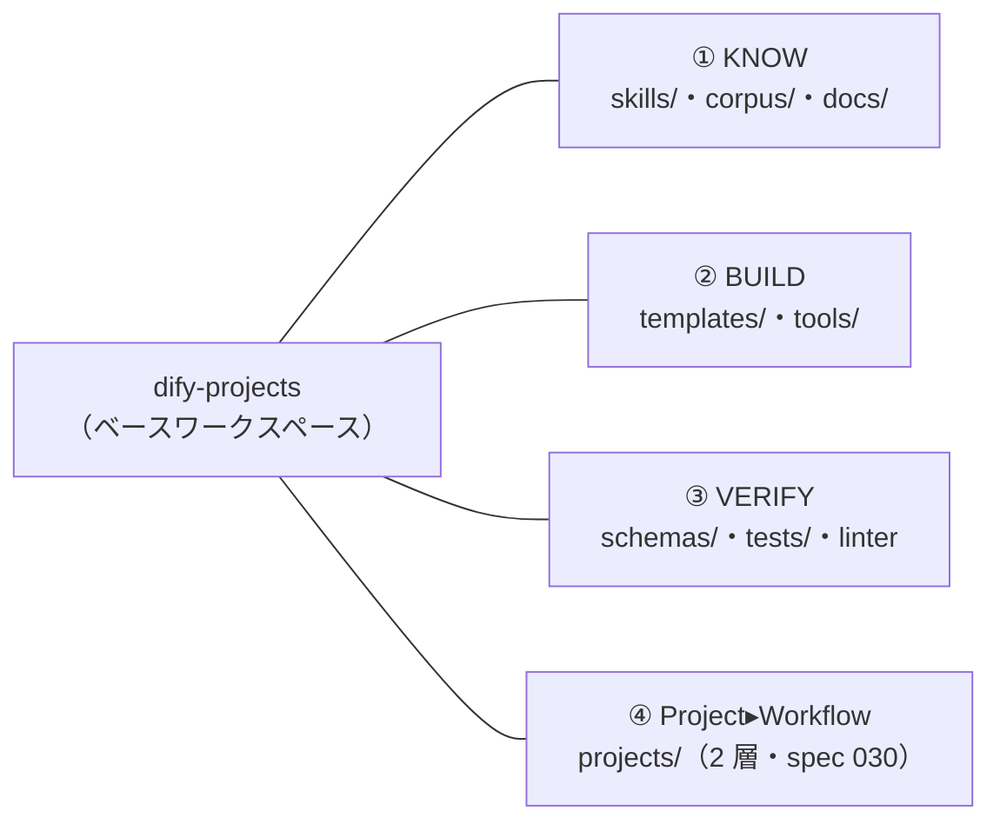
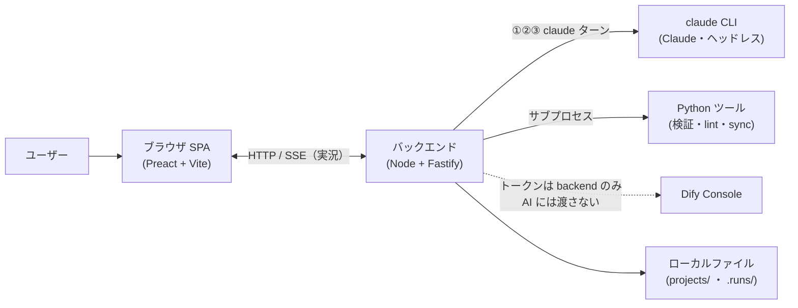
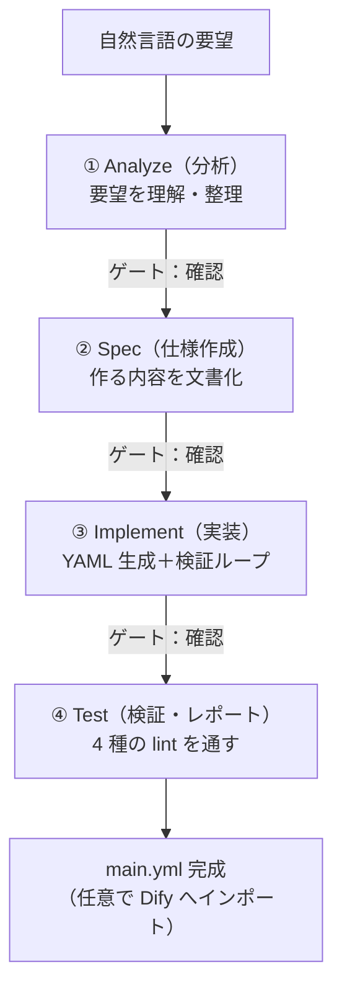
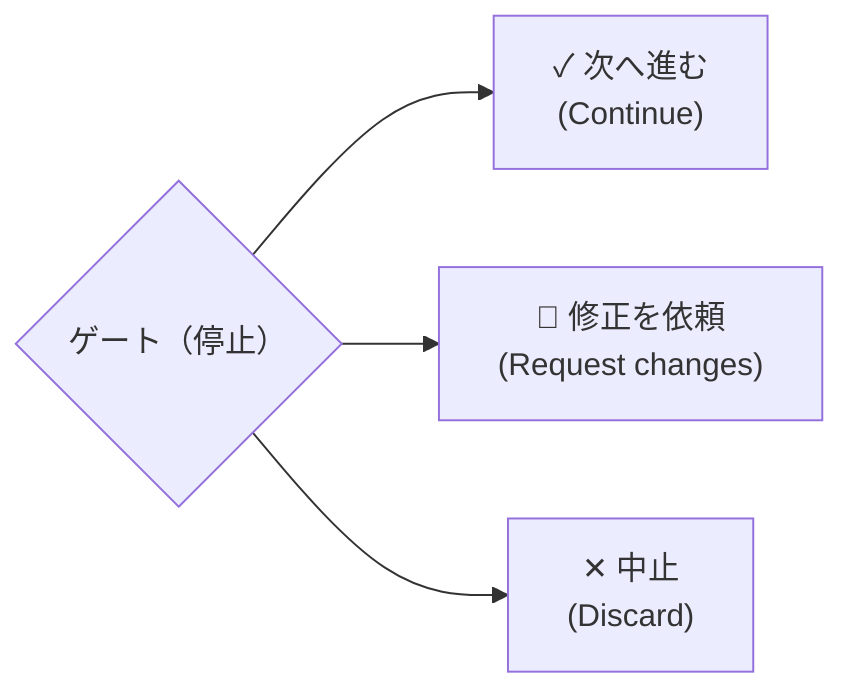
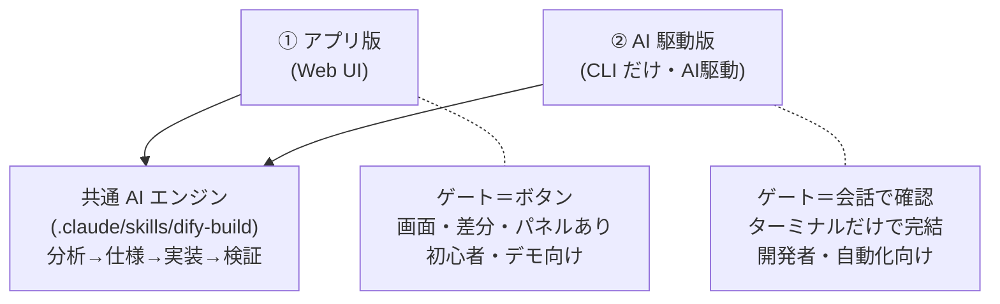
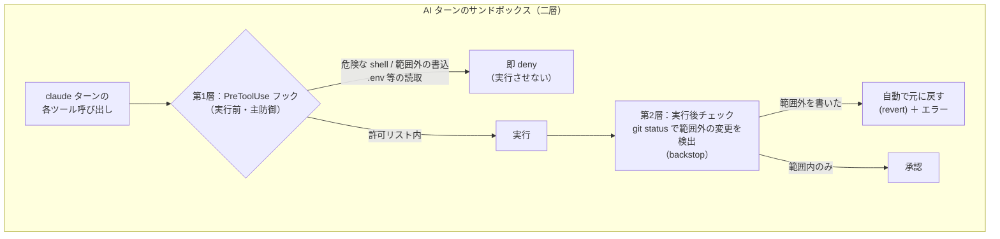

# Dify ワークフロービルダー — プロジェクト概要

> 自然言語の要望から、検証済みの Dify ワークフローを **AI と対話しながら** 自動生成するローカルアプリ。
> 各ステップに**人間の確認ゲート**を置き、安全に「Dify をコードとして」作ります。

---

## 1. ひとことで言うと

**「作りたいワークフローを文章で伝えると、AI が 4 段階で組み立て、人が要所で確認しながら、
動く Dify ワークフロー（YAML）を生成する」** ローカル Web アプリです。

- 入力：「開始 → LLM で要約 → 終了、というワークフローを作って」（日本語の要望でOK）
- 出力：検証済みの `main.yml`（必要なら Dify ワークスペースへ自動インポート）

---

## 2. 解決する課題

| 従来（Dify の GUI で手作業） | 本プロジェクト |
|---|---|
| 手作業で時間がかかる・ミスが多い | AI が要望から自動生成 |
| バージョン管理されない | すべて Git 上の YAML（コードとして管理） |
| ノード ID・変数参照の間違いに気づけない | 4 種の検証ツールで自動チェック |
| AI に任せると暴走・上書きが怖い | 各段階で人間が確認、サンドボックスで安全 |

---

## 3. 全体アーキテクチャ

リポジトリの 4 本柱（ベースワークスペース）：

Builder アプリのランタイム構成：

- **ブラウザ（SPA）**：見た目と操作だけ。ロジックは持たず、バックエンドの状態を表示するだけ。
- **バックエンド（Fastify）**：頭脳。AI ターンの起動・検証・状態管理・Dify との通信を担当。
- **claude CLI**：実際に分析・仕様作成・実装を行う AI（Claude — モデルは CLI 設定に従う）。
- **Python ツール**：既存の「Dify をコード化」する基盤（雛形生成・検証・Dify との同期）。
- すべて **`127.0.0.1`（自分の PC 内）** で動作。外部公開なし。

---

## 4. 4 つのフェーズ（ビルドの流れ）

- **①②③ は AI のターン**（毎回まっさらな `claude` を起動）。**④ はバックエンド処理**（AI を使わない）。
- 各フェーズの後に **「ゲート」** で一時停止 → 人間が次へ進めるか決めます。

### ゲートでの選択肢

### 確認モード（自動化の度合い）
- **各ステップ確認**：毎回止まる（一番丁寧）
- **仕様のみ確認**：仕様だけ確認、他は自動
- **自動**：最後まで自動で進む（ただし実装が直らない場合は安全のため停止）

---

## 5. 2 つの使い方（同じ AI エンジンを共有）

このプロジェクトの中心には **共通の「AI ビルドエンジン」**（`.claude/skills/dify-build`）があります。
このエンジンは「分析 → 仕様 → 実装 → 検証」の手順を定義したもので、**2 通りの使い方**ができます。
どちらも **まったく同じ 4 フェーズ** で動きます。

### ① アプリ版（Web ブラウザ）
- ブラウザで操作。ゲートは**ボタン**、進行状況やコードの**差分を画面で確認**できる。
- バックエンドが**安全管理**（サンドボックス・ロック・トークン分離）を追加で担当。
- 専門知識が少なくても使える → **デモ・非エンジニア向け**。

### ② AI 駆動版（CLI だけ＝「AI駆動」）
- アプリを起動せず、`claude` を直接立ち上げて **`dify-build` スキルを呼ぶだけ**。
- ゲートは「**会話での確認**」（「OK」「ここを直して」と返すだけ）。
- ターミナルで完結し、スクリプトや自動化に組み込みやすい → **開発者向け**。

> **ポイント：頭脳（AI エンジン）は 1 つだけ。**
> アプリ版は、その同じエンジンに「見やすい画面」と「安全な管理レイヤー」を**被せた**もの。
> 画面が要らなければ、**CLI（AI 駆動）だけでも同じ手順・同じ品質**のワークフローが作れます。

---

## 6. 主な特徴

- 🗣 **対話形式**：チャットで要望を伝えるだけ。専門知識が少なくても作れる。
- 🧩 **段階的＋人間確認**：4 段階に分け、要所で人がコントロール。AI に丸投げしない。
- ✅ **自動検証**：生成物は毎回 4 種の検証ツール（スキーマ・変数参照・プラグイン・ノード本体）でチェック。
- 🔁 **複数同時進行**：複数のワークフローを「途中（ゲート待ち）」のまま並行して持てる。
- 🚀 **そのまま Dify へ**：完成したら Dify ワークスペースへワンクリックでインポート（任意）。
- 📦 **すべてコード**：成果物は Git 上の YAML。差分・履歴・レビューが可能。

---

## 7. 安全設計（このプロジェクトの肝）

- 🔒 **ローカル限定**：`127.0.0.1` 固定。外部からアクセス不可。
- 🛡 **サンドボックス（権限モデル C）**：AI は許可された場所しか触れない。万一はみ出しても
  実行後の `git status` チェックで検出し、**自動で元に戻す**。
- 🔑 **Dify トークンを AI に渡さない**：認証情報はバックエンドのサブプロセス内だけ。
  AI ターン・画面・ログには一切出さない。
- ✋ **自動デプロイなし**：人が確認しない限り、Dify には何も送られない。
- 🔁 **同時実行は 1 ターンずつ**：複数ビルドを並行管理しても、AI が動くのは常に 1 つだけ
  （競合・暴走を防止）。

---

## 8. 技術スタック

| 層 | 技術 |
|---|---|
| フロントエンド | Preact + Vite + TypeScript（ダークテーマ、専用デザイン） |
| 通信 | HTTP ＋ **SSE**（処理の様子をリアルタイム表示） |
| バックエンド | Node.js + Fastify（**DB なし**、状態は JSON ファイル） |
| AI | **Claude**（`claude` CLI をヘッドレス起動 — モデルは CLI 設定に従う） |
| 基盤ツール | Python（雛形生成・検証 lint・Dify 同期 `sync.py`） |
| 連携先 | Dify Console API（プル／プッシュ） |

---

## 9. 現在の状況

- ✅ **コア機能 完成**：4 フェーズ＋ゲート＋ 4 種の検証＋ Dify 連携、すべて実装・統合済み。
- ✅ **その後の強化**：実 Dify でのライブテスト（ファイル入力対応・タイムアウト分類）、
  ゲートでの質問（Ask）モード、どのゲートでも修正依頼（Request changes）、エラーからの
  ワンクリック再試行、完成後の再編集、既存 YAML のアップロードをベースに編集、
  うまく動いたビルドを再利用パターンへ昇格（promote）、要件ダイジェスト付き Analyze。
- ✅ **さらに新しい強化（2026-07）**：**トリガー起点ワークフロー**（スケジュール／Webhook 起点 —
  タイムゾーンは明示的に Asia/Tokyo を設定）、**ツールノードを本当にビルド可能に**（プラグイン
  ハッシュは公開マーケットプレイスから **resolve**、`dependencies:` 必須）、外部 YAML の
  パターン昇格、E2E 計測ハーネス＋コスト/経緯エクスポート。
- ✅ **テスト済み**：サーバ・Web の全ユニットテストがグリーン（件数は `npm test` で確認 —
  ここには固定値を書かない）＋主要シナリオのブラウザ QA。
- 📋 **残り**：軽い手動確認（自動モードの実走、インポート後のトリガー有効化は Dify 側で手動）。
  旧 specs（001–067）は完了・退役（`git show ca5e39e:docs/specs/` で閲覧）；新 specs は 071 から。

---

## 10. まとめ（発表用の一言）

> **「Dify ワークフローづくりを、AI との対話で。ただし要所は人間が確認し、すべてコードとして
> 安全に管理する」** — それがこのプロジェクトです。
>
> - **スピード（AI 生成）× 安心（人間ゲート＋サンドボックス＋自動検証）** を両立。
> - **画面で使う「アプリ版」**でも、**ターミナルだけの「AI 駆動版」**でも、同じエンジンで作れる。
