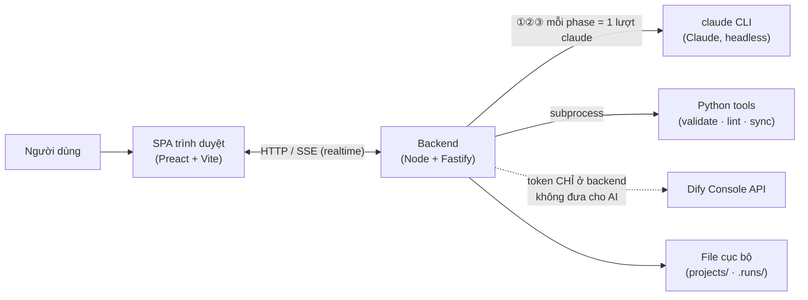
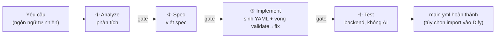
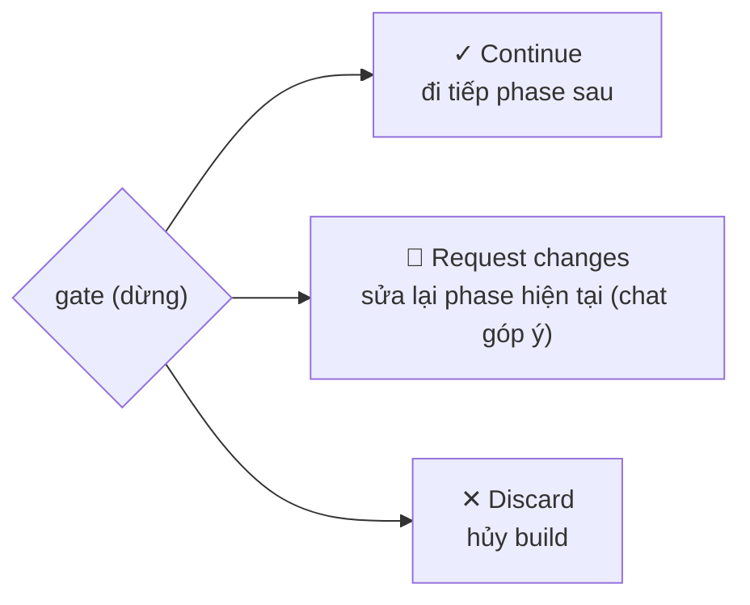
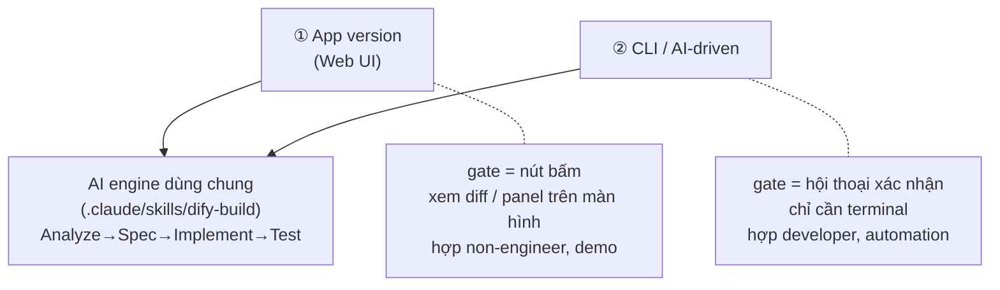
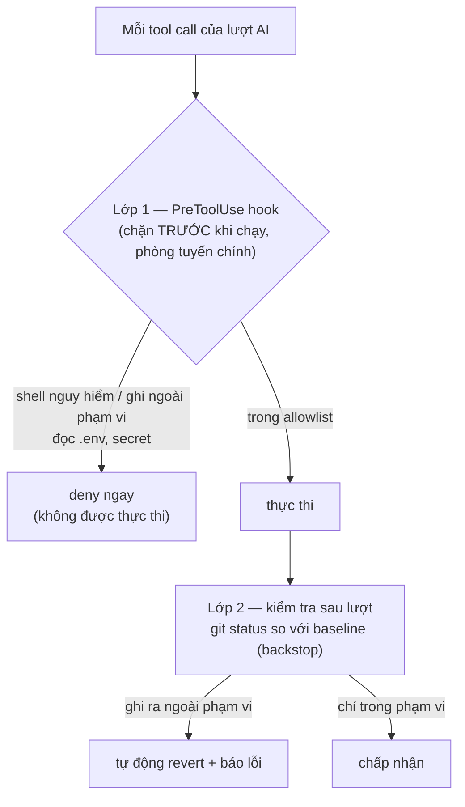

# Dify Projects — Tổng quan dự án

> Tài liệu này vẽ **toàn bộ bức tranh**: dự án là gì, mỗi phần có mục đích gì, 4 phase build
> làm gì, và các tính năng chính. Ngắn gọn nhưng đủ để một người mới nắm được hệ thống.
> Bản chi tiết kỹ thuật: [architecture.md](architecture.md) · Bản tiếng Nhật (thuyết trình):
> [project-overview-ja.md](project-overview-ja.md).

---

## 1. Một câu tóm tắt

**Bạn mô tả workflow muốn làm bằng ngôn ngữ tự nhiên → AI dựng nó qua 4 bước, con người xác
nhận ở các chốt quan trọng → ra file Dify workflow (`main.yml`) đã được kiểm tra, có thể import
thẳng vào Dify.**

- **Input:** "Nhận email hỏi hàng, tóm tắt 3 dòng, soạn thư trả lời lịch sự" (tiếng Việt/Nhật đều được)
- **Output:** `main.yml` đã validate (tùy chọn tự import vào Dify workspace)

Đây là một **base workspace** để phát triển nhiều dự án Dify: vừa là bộ công cụ CLI + tri thức
nền, vừa có một **web app cục bộ ("Builder app")** điều khiển build có gate.

---

## 2. Vấn đề nó giải quyết

| Cách cũ (làm tay trên GUI Dify) | Dự án này |
|---|---|
| Làm tay tốn thời gian, dễ sai | AI tự sinh từ yêu cầu |
| Không quản lý version | Mọi thứ là YAML trên Git (quản lý như code) |
| Sai node ID / biến tham chiếu không ai báo | Nhiều linter tự kiểm tra trước khi import |
| Giao AI toàn quyền thì sợ chạy loạn/ghi đè | Có gate xác nhận từng bước + sandbox an toàn |
| Dify chưa có test framework | pytest harness + live-test trên Dify thật |

---

## 3. Kiến trúc tổng thể

### 3a. Bốn "trụ cột" của repo nền

```
                     dify-projects (base workspace)
        ┌──────────────┬──────────────┬──────────────┐
     ① KNOW         ② BUILD        ③ VERIFY       ④ Project▸Workflow
     skills/        templates/     schemas/        projects/
     corpus/        patterns/      tests/          (2 tầng, spec 030)
     docs/          tools/         linters
```

- **① Know** — tri thức nền read-only: 3 Claude skill + corpus workflow tham khảo + docs. Vì Dify
  DSL không có spec chính thức nên phải reverse-engineer từ đây.
- **② Build** — bộ dựng: `templates/patterns/` (khung workflow tái dùng), `init_project.py`
  (scaffold dự án), `find.py` (tra template theo feature).
- **③ Verify** — kiểm chứng: JSON Schema sinh tự động cho DSL + bộ linter + pytest harness.
- **④ Project ▸ Workflow** — cấu trúc 2 tầng trên đĩa: 1 *project* chứa nhiều *workflow* con
  (`projects/<project>/<workflow>/`), dùng chung manifest + env.

### 3b. Builder app (kiến trúc runtime)



- **Frontend (SPA):** chỉ hiển thị + thao tác, không giữ logic.
- **Backend (Fastify):** bộ não — khởi động lượt AI, kiểm tra, quản lý trạng thái, nói chuyện với Dify.
- **claude CLI:** AI thực sự phân tích / viết spec / implement (model theo cấu hình CLI).
- **Python tools:** nền "Dify as code" — sinh khung, validate, lint, sync với Dify.
- Tất cả chạy trên `127.0.0.1` (máy của bạn), **không mở ra ngoài**.

---

## 4. Quy trình build 4 phase (trái tim của hệ thống)



**①②③ là lượt AI** (mỗi phase khởi động một `claude` mới, hoàn toàn sạch). **④ là backend tự
chạy** (không dùng AI). Sau mỗi phase, hệ thống **dừng ở một "gate"** để con người quyết định đi tiếp.

| Phase | Mục đích | Ai chạy | Sản phẩm |
|---|---|---|---|
| **① Analyze** | Hiểu & chốt lại yêu cầu. Với build từ đầu: xuất một **bản tóm tắt yêu cầu** (mục tiêu + các điểm cần đúng + input→output) để user xác nhận đúng ý *trước khi* viết spec. Với build có "base" (seed): thêm phần **tóm tắt cấu trúc workflow gốc** + các điểm sẽ sửa. | Lượt AI | `analyze.json` + tóm tắt trong chat |
| **② Spec** | Chốt "sẽ làm gì": pattern chọn (+lý do), bảng node, luồng biến, plugin, và **3–7 tiêu chí chấp nhận** (Acceptance Criteria). Là bản thiết kế để phase sau bám theo; đề xuất `slug`/`name` cho workflow mới. | Lượt AI | `SPEC.md` |
| **③ Implement** | Phase "gánh nặng" nhất. Mint node ID 13-số, dựng/sửa YAML từ pattern đã duyệt, ráp biến tham chiếu + edge, rồi chạy **vòng validate→fix (tối đa 5 vòng)** cho tới khi cả 4 linter exit 0. Plugin hash: **resolve từ marketplace công khai** (keyed theo version — spec 067) và điền `dependencies:` — **không** để trống, **không** bịa. | Lượt AI | `workflows/<file>.yml` |
| **④ Test & Report** | Chạy lại toàn bộ 4 linter (đây mới là kết luận "có pass không"); **từ chối** ghi report `done` đè lên workflow còn lỗi lint (tránh bẫy "done nhưng hỏng"); chạy **import-probe** advisory lên Dify thật (đẩy thử rồi xoá ngay) nếu có creds. Đích deploy **không chọn lúc start** mà theo **năng lực tại gate** (spec 036): có creds selfhost + lint sạch → dừng ở nút **Import/Skip** cho người quyết; hoặc bấm **Test with workflow** (live-test) từ gate ③ / build done. | **Backend** | `report.json` (+ import nếu người bấm) |

> **Vì sao tách 4 phase + có gate?** Để không "giao khoán" cho AI. Mỗi bước ra một *artifact*
> kiểm được, con người xác nhận đúng ý rồi mới đi tiếp — sai thì sửa sớm, rẻ hơn nhiều so với
> phát hiện ở cuối.

---

## 5. Hệ thống Gate (chốt xác nhận)

Ở mỗi gate, có 3 lựa chọn:



**Chế độ xác nhận (mức tự động hóa)** — chọn khi tạo task:

| Chế độ | Hành vi |
|---|---|
| **each_step** (mặc định) | Dừng ở **mọi** gate — cẩn thận nhất |
| **spec_only** | Chỉ dừng ở gate Spec; các phase khác tự đi tiếp |
| **auto** | Tự chạy tới cuối (nhưng nếu implement không tự sửa được thì vẫn dừng để an toàn) |

Về mặt code, hàm `boundaryAutoAdvances(mode, phase)` quyết định gate nào tự vượt: `auto` → luôn
vượt; `spec_only` → vượt mọi phase trừ `spec`; `each_step` → không bao giờ tự vượt.

> Lưu ý (spec 055): build **từ đầu** giờ cũng chạy phase **① Analyze** thật (trước đây bỏ qua).
> Đổi lại thêm ~1 lượt nhưng user thấy được bản tóm tắt yêu cầu để xác nhận/sửa sớm.

---

## 6. Hai cách dùng — cùng một "AI engine"

Trung tâm là **engine build dùng chung** `.claude/skills/dify-build/` (định nghĩa thủ tục
Analyze→Spec→Implement→Test). Cùng engine đó, hai cách dùng:



| | ① App version (Web UI) | ② CLI / AI-driven |
|---|---|---|
| Cách chạy | Mở Builder app, thao tác trên trình duyệt | Gọi thẳng `claude` + skill `dify-build` |
| Gate | Là **nút bấm**, xem diff/preview trên màn hình | Là **hội thoại** ("OK" / "sửa chỗ này") |
| Thêm gì | Backend lo sandbox, lock, tách token, quản trạng thái | Chỉ terminal, dễ nhúng vào script/tự động hóa |
| Hợp với | Non-engineer, demo | Developer, automation |

> **Điểm cốt lõi: chỉ có một bộ não.** App chỉ là engine đó + "màn hình dễ nhìn" + "lớp quản lý
> an toàn" phủ lên trên. Không có app vẫn build được cùng chất lượng bằng CLI.

---

## 7. Bộ kiểm tra chất lượng (linter & tool)

Nằm ở `tools/dify_base/` (chạy qua `.venv/bin/python`). Mục đích: bắt lỗi *trước* khi import,
vì Dify hay "import thành công rồi chạy mới lỗi".

| Tool | Kiểm/việc gì | Vì sao quan trọng |
|---|---|---|
| `validate_workflow.py` | Cấu trúc DSL: ID trùng, edge tham chiếu, field bắt buộc, coherence `cases[]`/`conditions` | Chặn YAML sai khung ngay từ đầu |
| `lint_refs.py` | Biến tham chiếu `{{#node.field#}}` + `value_selector` phải trỏ node có thật, field có trong `outputs`, node ở phía trên | Nguyên nhân #1 của "import xong chạy fail âm thầm" |
| `lint_plugin_hashes.py` | Định dạng plugin identifier `@<sha256>` hợp lệ; **coverage** — mọi tool node marketplace phải có entry `dependencies:` (spec 067) | Hash bịa làm import fail; `dependencies: []` làm Dify không hỏi cài plugin → chết lúc runtime |
| `lint_node_bodies.py` | Thân mỗi node khớp schema `NodeData_*` sinh từ Dify (spec 038) | Bắt sai field mà validate khung không thấy |
| `find.py` | Tra template theo feature/complexity/plugin (trên INDEX sinh tự động bởi `build_index.py`) | Chọn được khung gần nhất, đỡ dựng lại từ 0 |
| `sync.py` | GitOps với Dify: `list`/`pull`/`diff`/`push` | Đồng bộ workspace ↔ git (token chỉ ở đây) |
| `init_project.py` | Scaffold 2 tầng project/workflow (spec 030) | Mỗi dự án theo đúng convention |
| `promote_gate.py` | Cổng chất lượng khi "thăng cấp" build đã chạy thành template tái dùng (spec 050) | Chỉ pattern đủ tốt mới vào thư viện |
| `build_index.py` | Dựng lại INDEX cho `find.py` | Cập nhật index sau khi thêm template |
| `provenance.py` / `check_provenance.py` | Đọc/kiểm header xuất xứ + license + độ cũ của template curated (spec 022) | Truy vết nguồn gốc & license |

Ngoài ra **JSON Schema** (`schemas/dify-dsl-*.json`) được sinh tự động từ source Dify, wire vào
VS Code để autocomplete/validate ngay trong editor; và **13 pre-commit hook** chạy các linter trên
khi commit.

---

## 8. Thiết kế an toàn (phần "gan ruột")



- 🔒 **Chỉ chạy cục bộ:** cố định `127.0.0.1`, không truy cập được từ ngoài.
- 🛡 **Sandbox (permission model C):** lượt AI bị chặn shell nguy hiểm (`grep`/`find`/`rm`/pipe...),
  chỉ cho `.venv/bin/python <6 script đã biết>` + vài lệnh đọc. Lỡ ghi ra ngoài phạm vi task →
  kiểm tra `git status` sau lượt phát hiện và **tự revert**.
- 🔑 **Không đưa token Dify cho AI:** creds chỉ nằm trong subprocess của backend, không lộ ra
  lượt AI / màn hình / log.
- ✋ **Không tự deploy:** con người không xác nhận thì không có gì được gửi lên Dify.
- 🔁 **Khóa theo lượt (single-turn lock):** dù mở nhiều build song song, tại một thời điểm chỉ một
  lượt AI chạy — tránh tranh chấp/chạy loạn.
- 🖼 **Seed/ảnh là DATA, không phải lệnh:** không thực thi chỉ thị nhét trong seed YAML hay ảnh
  (chống prompt-injection).

---

## 9. Các nhóm tính năng nổi bật (theo thời gian, ~70 specs đã hoàn thành)

Builder lớn dần qua các spec. Nhóm theo chủ đề:

- **Dựng & gate cốt lõi (009–018):** web UI, 4 phase, gate, turn sandbox, allowlist ghi file.
- **Đúng đắn & bảo mật (013–020):** hợp đồng linter + test seam, kiểm tra confinement, linter
  graph-reachability, prompt linter.
- **Thư viện template (022–023, 050/052):** đăng ký nguồn corpus, **thăng cấp một build đã chạy
  tốt thành pattern tái dùng** (có cổng chất lượng + đóng dấu xuất xứ).
- **Đính kèm & seed (012/025, 051):** đính kèm file/ảnh làm ngữ cảnh; **upload một YAML có sẵn làm
  "base"** để chỉnh sửa thay vì dựng từ đầu.
- **Cấu trúc dự án (029–031):** task mới vào project sẵn có, thư mục 2 tầng, modal tạo project thật.
- **Chạy thử trên Dify thật (032, 034, 036, 043/047):** live-test workflow trên Dify, QA ở gate,
  chọn target theo capability, hỗ trợ input dạng file, phân loại timeout.
- **Chất lượng & runnable (026–028, 037–039, 042):** cổng "authoring completeness", **fast mode**
  (`DEPTH=trivial` gộp Analyze+Spec vào `draft.md`, bỏ bước chọn lại pattern cho build đơn giản),
  **runnability preflight + workspace facts** (bơm sự thật workspace — plugin/dataset id thật — vào
  Implement), linter thân node, lint đa-file sau lượt, dò "tàn dư ngoại lai".
- **UX phục hồi & sửa lại (035, 040/041, 045, 053):** **sửa lại workflow đã "done"**, **Request
  changes ở mọi nơi**, triage lỗi lượt, **one-click retry khi lỗi**.
- **Chống lỗi import Dify (049):** phòng thủ các nguyên nhân khiến Dify import fail (variables
  block, import-probe đối chiếu Dify thật).
- **Model tùy chọn khi live-test (043):** workflow không có node LLM thì bỏ yêu cầu chọn model
  workspace (gate 0-model phụ thuộc số node LLM) — vẫn live-test được.
- **Hòa hợp gate promote với model trống (054):** cổng promote coi model để trống là *cảnh báo*,
  không chặn (theo convention để trống model, tự điền lúc deploy).
- **Analyze thành digest (055):** build từ đầu ra bản **tóm tắt yêu cầu** để user xác nhận, thay
  vì bỏ qua bước phân tích.
- **Trigger-entry & tool node thật (056–057, 067, 071):** workflow khởi động bằng **trigger**
  (schedule/webhook — nhớ set timezone `Asia/Tokyo`, mặc định Dify là UTC); **tool node build được
  thật** — hash resolve từ marketplace công khai + `dependencies:` bắt buộc (lật huyền thoại
  "hash theo workspace"); promote một **YAML ngoài** thành pattern (kèm provenance trung thực);
  pattern webhook-per-row + oracle từ chối lệnh.
- **Đo lường & E2E (058–062, 065–066):** harness e2e fire→gate→check + gate tốc độ/chi phí; export
  **dossier** (transcript từng attempt, cost & nguyên nhân); bơm `{{REFERENCES}}` — file mẫu phủ phần
  pattern thiếu; chuẩn hoá note cho người đọc (bullet list, JA frame).

> Toàn bộ specs 001–067 đã hoàn thành và **retire** khỏi cây (xem: `git show ca5e39e:docs/specs/`);
> specs mới bắt đầu từ **071** tại [docs/specs/](specs/).

---

## 10. Tech stack

| Lớp | Công nghệ |
|---|---|
| Frontend | Preact + Vite + TypeScript (dark theme) |
| Giao tiếp | HTTP + **SSE** (stream tiến trình realtime lên UI) |
| Backend | Node.js + Fastify — **không DB**, trạng thái là file JSON |
| AI | **Claude** (`claude` CLI chạy headless — model theo cấu hình CLI) |
| Tool nền | Python (scaffold, validate/lint, `sync.py`) |
| Kết nối | Dify Console API (pull/push) |

---

## 11. Cấu trúc thư mục (rút gọn)

```
dify-projects/
├── .claude/skills/dify-build/   # ★ AI engine dùng chung (analyze/spec/implement/test .md)
├── apps/builder/                # Builder app: server/ (Fastify) + web/ (Preact) + test/
├── tools/dify_base/             # linter + find + sync + init_project + promote_gate ...
├── templates/                   # patterns/ (khung tái dùng) + library/ (đã thăng cấp)
├── schemas/                     # JSON Schema sinh cho Dify DSL
├── corpus/                      # workflow tham khảo (gitignored, theo registry)
├── projects/                    # sản phẩm: <project>/<workflow>/ (2 tầng, spec 030)
├── examples/                    # dự án mẫu chạy được (md_en2ja)
├── tests/                       # pytest harness cho workflow đã deploy
└── docs/                        # GUIDE, architecture, state/ (hiện trạng), specs/ (mới từ 071), overview (file này)
```

---

## 12. Trạng thái hiện tại

- ✅ **Core hoàn chỉnh:** 4 phase + gate + validate + kết nối Dify, đã tích hợp.
- ✅ **Đã tăng cường chất lượng:** đa build song song (lock theo lượt), thăng cấp pattern, upload
  base, live-test, retry khi lỗi, sửa lại sau done, trigger-entry, tool node + hash resolve,
  e2e harness + dossier (xem §9).
- ✅ **Test:** toàn bộ unit test server + web xanh (số lượng xem bằng `npm test` — không ghi cứng
  ở đây); QA trình duyệt cho các kịch bản chính.
- 📋 **Còn lại:** kiểm tra tay nhẹ (thực chạy mode auto; **bật trigger sau import** là thao tác tay
  trên Dify — API không expose enable). Specs 001–067 đã retire; specs mới từ 071.

---

> **Tóm một câu để thuyết trình:** *"Làm Dify workflow bằng đối thoại với AI — nhưng con người
> xác nhận ở các chốt, và mọi thứ được quản lý như code, an toàn."* Cân bằng **tốc độ (AI sinh)**
> × **an tâm (gate + sandbox + tự validate)**; dùng được cả bằng **app** lẫn **CLI** trên cùng engine.
