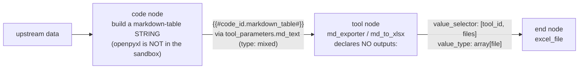

# Runtime Supplement — project-discovered findings

This file supplements [skills/mango-svip/references/constraints.md](../skills/mango-svip/references/constraints.md)
with **project-discovered facts** that originate in this repo's `projects/`
workflows and shouldn't live in the upstream `mango-svip` skills clone
(which is gitignored, externally maintained, and wiped/refreshed by
[scripts/setup.sh](../scripts/setup.sh)).

The upstream constraints.md is authoritative for general Dify runtime rules.
This file adds **net-new** findings that are evidence-backed by checked-in
test workflows under `projects/*/workflows/`. When a finding here is general
enough to upstream, send a PR to `mango-svip/dify-workflow-skills` and remove
the row here.

> See [AGENTS.md §2](../AGENTS.md) for the "do NOT edit external clones" rule
> that motivated this split, and spec 007 revision 2 for the rationale (retired 2026-07-17 —
> `git show ca5e39e:docs/specs/007-capability-docs-and-patterns.md`).

## §1-supplement — Code-node Python sandbox: confirmed-missing modules

The base `constraints.md §1` lists the verified-working stdlib modules
(`json`, `csv`, `re`, `math`, `datetime`, `io`, `collections`, `itertools`).
The following modules are **confirmed NOT available** in the Dify Code-node
sandbox via a checked-in probe workflow — do not waste time designing logic
that depends on them; use the alternative path in the rightmost column.

| Module     | Evidence | Alternative |
|------------|----------|-------------|
| `openpyxl` | probe `test_openpyxl_feasibility.yml` — `ImportError: No module named 'openpyxl'` | Code → Tool node bridge: build a markdown table in Code, feed it to a `bowenliang123/md_exporter` `md_to_xlsx` **tool node** (shape below; see [plugin-capabilities.md](plugin-capabilities.md) for inline-formatting caveats). |

> **Note (2026-07-03):** the `projects/eiken_stem_proofread/workflows/*.yml` probe workflows these
> tables cite were **removed** from the tree — the findings stand, but the links are gone (history:
> `git show 565480c^:projects/eiken_stem_proofread/workflows/<file>`). **Do not chase those paths.**

### `md_to_xlsx` tool node — the correct `builtin` shape (verbatim from a lint-clean build)

The Code → Tool bridge this shape implements:



This block is copied verbatim from a build whose 4 linters (incl. `lint_node_bodies.py` against the
generated `NodeData_ToolNodeData` schema) passed — so it is **schema-valid**. `node_types.md §13`'s
generic example shows `provider_type: api` and omits several required keys — it does **NOT** match a
real marketplace-plugin tool node. Use this shape for `bowenliang123/md_exporter`
(`md_to_xlsx` / `md_to_csv` / `md_to_docx`) so a build does not have to reverse-engineer it. The tool node
declares **no `outputs:`** — a downstream node reads its `files` (and `text`) via `value_selector`.

> **Updated by spec 067 (2026-07-17; retired — `git show ca5e39e:docs/specs/067-tool-nodes-are-buildable.md`).** This section used to
> end: *"the `@sha256` still needs the workspace hash before a real import … Keep `dependencies: []` +
> the `# TODO:` hash comment (never fabricate the `@sha256`)."* Both halves were wrong, and this file
> is the one `SKILL.md` sends a build to **first** for exactly this question — so the error was
> load-bearing. The truth: the hash is the **public marketplace package checksum**, keyed to
> (plugin, version) and identical in every workspace — **resolve** it
> (`.venv/bin/python tools/dify_base/marketplace.py resolve bowenliang123/md_exporter`, or copy from
> `templates/tool-catalog.json`), never invent it. And **`dependencies:` MUST be filled**: Dify raises
> its "install this plugin" prompt only when the imported DSL carries a **non-empty** top-level
> `dependencies:` array (the graph-derived fallback is dead above DSL 0.1.5), so `[]` + `# TODO` is the
> case where the import succeeds, nothing prompts, and the node fails at **runtime**.
> `lint_plugin_hashes.py` now fails a tool node whose plugin is unlisted.

```yaml
- data:
    title: Markdown → XLSX
    type: tool
    provider_id: bowenliang123/md_exporter/md_exporter    # provider name doubled
    provider_name: bowenliang123/md_exporter/md_exporter
    provider_type: builtin                                 # NOT `api`
    tool_name: md_to_xlsx
    tool_label: md_to_xlsx
    tool_configurations: {}
    tool_parameters:
      md_text:
        type: mixed
        value: '{{#<upstream_code_id>.markdown_table#}}'   # a Markdown-table string
  id: '<fresh 13-digit id>'
  type: custom
# downstream `end` reads the produced file:
#   - variable: excel_file
#     value_selector: ['<this tool id>', files]
#     value_type: array[file]
```

> **Version drift (v3.6.9):** the shape above was verified on md_exporter **v2.1.1**. The current
> catalog (`templates/tool-catalog.json`, resolved at **v3.6.9**) marks `md_to_xlsx` as requiring
> **`force_text_value`** (select, required) alongside `md_text` — a build against v3.6.9 must supply
> it (the catalog carries no `form` field, so confirm at build time whether it belongs in
> `tool_configurations` or `tool_parameters`; omitting a required param fails at runtime). Cosmetic:
> the catalog's `tool_label` for this tool is `Markdown tables ⮕ XLSX` — the schema only requires the
> field to be present, not to match the catalog string.

**Important caveats**:

- The list is **observed-not-exhaustive**. Dify does not publish a sandbox
  spec and sandbox config may differ between Dify Cloud and self-host
  deployments. A module missing here in one workspace may exist in another.
- To probe additional modules in YOUR target workspace, import + run
  [templates/probes/stdlib_check.yml](../templates/probes/stdlib_check.yml).
  The probe is read-only (no network, no filesystem) and safe to re-run.
  Paste the output into your project's `spec_todo/` or equivalent.

### `http-request` node with a JSON body — the correct `data` shape

A `body.type: json` carries **exactly ONE** `data` entry, whose `key` is the empty string and whose
`value` is the complete JSON document as a string:

```yaml
body:
  type: json
  data:
  - key: ''
    type: text
    value: '{{#<code_node_id>.payload#}}'
```

Per-field `data` entries (one entry per JSON key) belong to `form-data` / `x-www-form-urlencoded`
bodies only; writing them under `type: json` does not error at import — the receiver just sees a
malformed or empty payload at run time.

Corollary for any body built from generated text: a report containing newlines or TABs must be
serialized in a code node with `json.dumps` first and the resulting **string** sent as the whole
body. Interpolating raw multi-line text into a hand-written JSON body breaks the body. Field-proven
on a lint-clean import.

### `http-request` — the two fields the backend accepts and the editor rejects

Both of these ship a workflow that imports clean, passes all four linters, and runs green — while
being wrong. Field-observed on Dify 1.15 (2026-08-13), 9 nodes in one build.

**(a) An object/array `default_value` must be a JSON STRING.** Under `error_strategy: default-value`,
a row typed `object` or `array[...]` carries its default as a quoted string, not as YAML structure:

```yaml
error_strategy: default-value
default_value:
- { key: body, type: string, value: '' }
- { key: status_code, type: number, value: 0 }
- { key: headers, type: object, value: '{}' }   # '{}' — QUOTED. Never bare {}.
```

The backend coerces either form (`DefaultValue.validate_value_type` runs `json.loads` on a string),
which is exactly why nothing catches the mistake. The editor hands the value straight to Monaco,
which requires a string: on a real mapping `createTextBuffer()` falls through to `factory.create(…)`
and throws `TypeError: $.create is not a function`. **The node's config panel then goes blank the
moment anyone clicks the node** — the run still works, but the workflow can no longer be edited.

The row list must mirror the node's outputs exactly. For `http-request` that is three rows and only
three — `body` / `status_code` / `headers` — the same list Dify's editor writes itself. A `files`
row is not part of the contract and has no widget at all.

**(b) `timeout` binds on `connect` / `read` / `write` — not `max_*_timeout`.**

```yaml
timeout: { connect: 10, read: 30, write: 10 }
ssl_verify: true
```

`max_connect_timeout` / `max_read_timeout` / `max_write_timeout` appear in exported DSL and read like
the real names, but they are the UI slider's **cap** — Dify's `default.ts` seeds them at 0 on every
fresh node, and the backend model `HttpRequestNodeTimeout` has no such fields and drops them. A node
carrying only `max_*` has **no timeout set**: it falls back to connect=10 / read=600 / write=600, so
a hung receiver stalls the run for ten minutes instead of the seconds you wrote.

Both are now caught (warn-only) by `lint_node_bodies.py` via `schemas/editor-state-overlay.json`.
Worked example: [.claude/skills/dify-build/references/error-strategy.yml](../.claude/skills/dify-build/references/error-strategy.yml), node `1754000000007`.

## §2-supplement — Iteration ≤30: clamp the batch COUNT (not a fixed batch size); and max_tokens for long generation

Refines constraints.md §2 (the ≤30-items hard cap; >30 fails at run time with **no clear error**). Two
gaps a real build hit — evidence: a chunked long-doc-translate build
(`docs/prompts/runs/2026-07-22-R9-G04-1784728820870.md`) chunked at a fixed size and produced ~34–50
iterator items on a long input, silently exceeding 30.

**(a) A fixed batch size does NOT guarantee ≤30 items.** constraints.md §2's snippet uses a constant
`BATCH_SIZE`, so the batch COUNT is `ceil(N / BATCH_SIZE)` — still `> 30` once N is large enough (400
items ÷ 10 = 40 batches). When N is set by **runtime input** (chunked text, parsed rows, search hits),
size the batch from N so the count is capped:

```python
# ≤30 iterator items for ANY N. Compute size from N so the COUNT is clamped, not the size.
n = len(items)
size = max(1, -(-n // 30))                      # ceil(n / 30)
batches = [items[i:i + size] for i in range(0, n, size)]   # len(batches) ≤ 30, proven for all n
return {"batches": batches}                     # iterate over batches; expand inside each
```
(For text: first split into `items` by paragraph/sentence, then apply the same clamp to that list.)

**(b) An LLM node that emits long content needs an explicit `max_tokens`.** A node producing a chapter,
a translated chunk, or a full section with only `temperature` set can hit the provider's **default**
max_tokens and truncate mid-output **silently** — a direct contradiction of a "translate/write it all"
requirement. Set `completion_params.max_tokens` sized to the expected output (e.g. a 4000-char JA chunk
→ EN needs well over the default). This is the recurring "finding K" across campaigns.

## Cross-references

- [skills/mango-svip/references/constraints.md](../skills/mango-svip/references/constraints.md)
  — upstream authoritative constraints (§1-§10)
- [docs/plugin-capabilities.md](plugin-capabilities.md) — plugin per-tool
  behavior matrix
- [templates/probes/stdlib_check.yml](../templates/probes/stdlib_check.yml)
  — probe workflow for per-workspace verification
- [AGENTS.md §8](../AGENTS.md) — doc index for agents

## Adding new findings to this file

A finding belongs here when ALL of:

1. Originates in this repo's `projects/*/workflows/` (not a generic Dify
   behavior).
2. Has a checked-in probe / test workflow that reproduces it.
3. Is **net-new** vs upstream `constraints.md` (don't duplicate; add a row
   only when the upstream cell would be misleading without the addition).

If the finding is general enough to apply outside this repo, upstream it to
`mango-svip/dify-workflow-skills` and remove from here.
