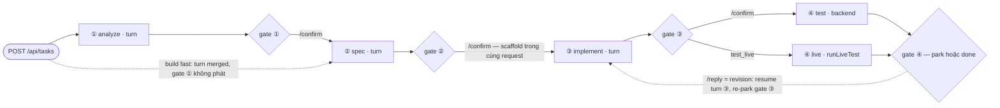
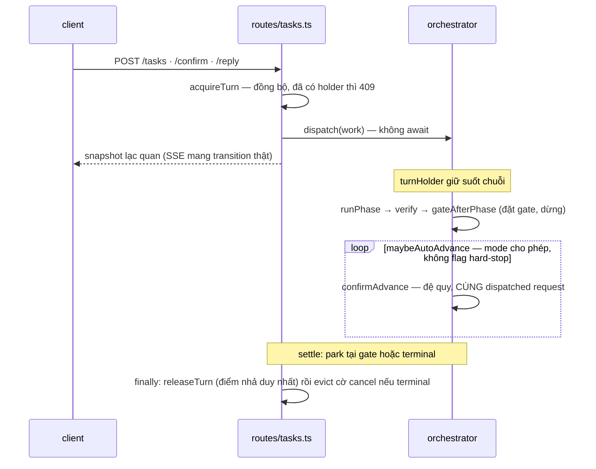
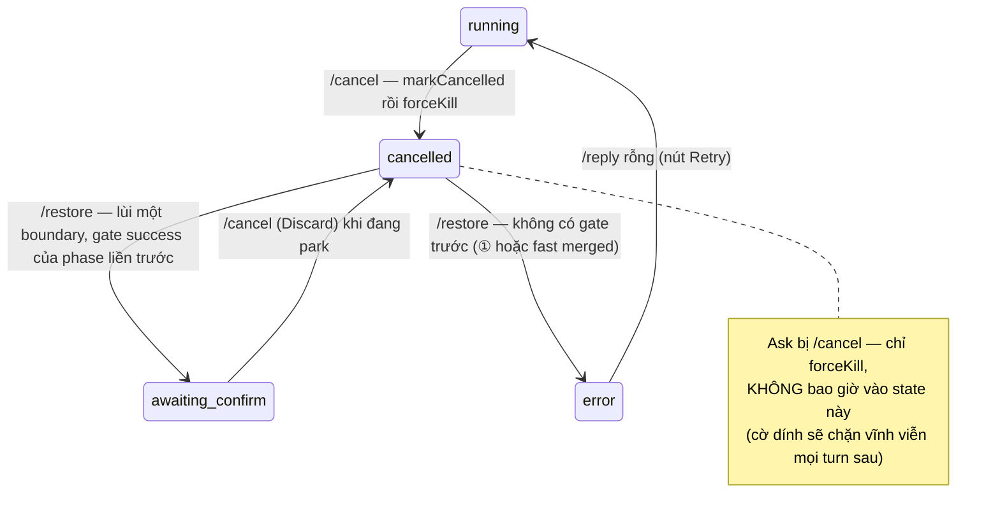
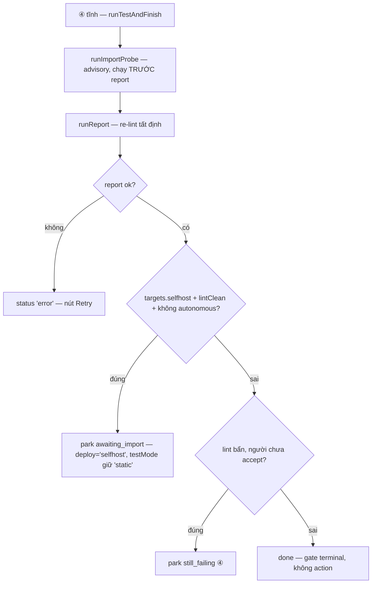

# Hiện trạng — vòng đời build

Ai phát turn kế tiếp; build dừng / tiến / lỗi / huỷ / khôi phục ra sao; và sống sót qua restart
bằng cách nào.

Phạm vi: `orchestrator.ts` · `orchestrator-shared.ts` · `gate.ts` · `phases.ts` · `state/task.ts` ·
`lock.ts` · `routes/tasks.ts` · `recovery.ts`.

> - Chuỗi trong backtick là **nguyên văn** code phát ra hoặc đọc — không dịch.
> - Tài liệu này mô tả **bất biến**, không chứa số đo.
> - **Một** turn chạy ra sao (spawn, sandbox, post-turn verify): `turn-and-sandbox.md`. Nội dung
>   workspace facts / `{{KNOWLEDGE}}` và wording của probe verdict: `readiness-and-plugins.md` §5–7.
>   Đây là tầng **điều phối giữa các turn**.

---

## 1. FSM 4 phase

`PHASE_ORDER` = `analyze` → `spec` → `implement` → `test` (`state/task.ts`). Định nghĩa từng phase:
`phases.ts` → `PHASES`.

| phase | `kind` | prompt gửi đi | artifact chính chủ |
|---|---|---|---|
| ① `analyze` | `turn` | `.claude/skills/dify-build/analyze.md` | `apps/builder/.runs/<taskId>/analyze.json` |
| ② `spec` | `turn` | `spec.md`; build fast **chưa scaffold** → `draft.md` (merged Analyze+Spec) | `projects/<project>/<workflowSlug>/SPEC.md`; trước scaffold → `.runs/<taskId>/SPEC.md` |
| ③ `implement` | `turn` | `implement.md` | `projects/<project>/<workflowSlug>/workflows/<workflowFile>` |
| ④ `test` | `backend` | **không có** | `.runs/<taskId>/report.json` |

**④ không bao giờ là turn.** Slot `test` trong `PHASES` không có `promptFile` — file
`.claude/skills/dify-build/test.md` tồn tại trên đĩa nhưng **không bao giờ được gửi**. ④ tĩnh là
`runTestAndFinish` (`orchestrator.ts`): chạy lại linter qua `runReport`, ghi `report.json` — phán
quyết cuối là kết quả linter **tất định**, không phải model tự chấm bài của mình. Hai thứ trông
giống "turn ở ④" thật ra không phải turn-④: nhánh live (`runLiveTest`, `live-test.ts` —
[dify-io.md](dify-io.md) sở hữu) và một `/reply` tại gate ④, vốn **quay về turn Implement** (§7).

Prompt render: `renderPrompt` thay **mọi** `{{TOKEN}}` theo bảng token của `vars()` — token một
phase không dùng nhận `''` (riêng `DEPTH` nhận `standard`), nên không `{{…}}` nào sống sót vào
prompt. `phases.ts` **io-free theo hợp đồng**: `KNOWLEDGE` (và `REFERENCES`) luôn `''` ở đây; orchestrator
ghi đè cho ③ (§2). `PATTERN_PATH` đi qua allowlist `^[A-Za-z0-9_-]+(\.yml)?$` — `analysisPattern` là thứ turn ①
tự ghi (không tin được), tên không lọt allowlist thoái hoá thành `''` chứ không thành đường dẫn
traversal. `languagePin` phát hiện kana → chèn chỉ thị tiếng Nhật lên **đầu** prompt (fresh lẫn
`/reply`); requirement Latin → `''`.

Status (`state/task.ts`): `running` · `awaiting_confirm` · `done` · `error` · `cancelled` là năm
trạng thái công khai; `scaffolding` là sub-state nội bộ quanh scaffold ở gate Spec, boot reconcile
đối xử nó như `running` (§9).

Thang đầy đủ, nhìn một hình:

Mỗi gate ①–③ còn `/reply` (re-run phase **hiện tại**, không tiến — §2) và Discard = `/cancel`
(§6); bộ nút đầy đủ từng gate + các outcome ④: §3. Ai *bấm* `/confirm` — người hay
`maybeAutoAdvance` — là §2.

## 2. Ai phát turn kế tiếp

Gate được thực thi bằng **ai phát turn**, không phải một cờ "dừng" mềm. Ba entry point, mỗi cái là
một HTTP request riêng (`routes/tasks.ts` → `orchestrator.ts`):

| route | hàm | làm gì |
|---|---|---|
| `POST /api/tasks` | `startTask` | prelude seed nếu là build seeded/edit-existing (`difySeedScaffoldAndPull`/`localEditSeed` — fail thành gate `error` ① trước mọi turn), rồi chạy ① (build fast: chạy thẳng slot ② merged — gate Analyze **không bao giờ** được phát) rồi gate |
| `POST /api/tasks/:id/confirm` | `confirmAdvance` | tiến đúng **một** boundary, turn mới tinh (không resume xuyên phase) |
| `POST /api/tasks/:id/reply` | `replyWithin` | re-run phase **hiện tại** qua `--resume <sessionIds[phase]>`, re-gate, **không** tiến |

Sau mỗi phase, `gateAfterPhase` đặt `task.gate` + `status` rồi **dừng** — không tự phát turn kế.
`maybeAutoAdvance` quyết định có tự bấm nút confirm chính hay không, và nếu có thì **đệ quy
`confirmAdvance` bên trong cùng một dispatched request** — turn lock giữ suốt chuỗi (§5).

`boundaryAutoAdvances(mode, phase)` (đã xác minh bằng chạy):

| `confirmMode` | dừng ở |
|---|---|
| `auto` | không boundary nào |
| `spec_only` | chỉ sau ② |
| `each_step` **và mọi giá trị hỏng/lạ** | mọi boundary — fail-safe về phía dừng, không bao giờ về phía tự chạy |

`maybeAutoAdvance` **hard-stop** bất kể mode khi: status không phải `awaiting_confirm`; gate mang
flag `still_failing` / `awaiting_import` / `test_result` / `infra_degraded`; hoặc build
`auto`+fast mà `analysisFeatures` không phải mảng **khác rỗng** toàn `llm`
(`featuresSubsetOfLlm` — rỗng/vắng cũng hard-stop, kèm note
`Fast build found a non-trivial shape — review before continuing`). Không còn action `confirm` nào
(④ terminal) → hết đường tiến.

Hai việc backend "đi kèm boundary":

- **②→③**: `scaffoldAtSpecGate` (thuộc `scaffold.ts` —
  [scaffold-and-layout.md](scaffold-and-layout.md) sở hữu) chạy **trong** cái
  `/confirm` đóng Spec, trước turn ③.
- **③→④ không cửa sổ**: khi ③ và ④ nằm trong **cùng một** dispatched request (auto-advance),
  `confirmAdvance` chuyển lint codes ③ vừa verify cho ④ qua tham số `internal` — **cố ý không**
  phải field của `ConfirmPayload`, vì payload là body HTTP và một client tự khai `reuseLint` sẽ né
  được lần re-lint ④ trên đường có người can thiệp. Mọi đường có cửa sổ người (continue của
  `each_step`, accept ④, `/reply`) đều re-lint.

Trước mỗi turn ③, orchestrator harvest workspace facts và render vào `{{KNOWLEDGE}}` — cơ chế và
nội dung: `readiness-and-plugins.md` §5. Cùng seam đó, `{{REFERENCES}}` (spec 065) nhận danh sách
file vetted phủ phần pattern được chọn còn thiếu (`gapReferences`); cả hai token đều `''` trong
`phases.ts` theo hợp đồng io-free, chỉ orchestrator ghi đè cho ③. Ảnh đính kèm nối vào **đuôi** prompt qua
`attachmentBlock` — seam duy nhất phủ cả prompt fresh lẫn prompt resume (prompt resume **không**
đi qua `injectVars`). Một `/reply` bọc text người dùng dưới header nguyên văn
`## Change request (revise the existing artifact; do not restart from scratch)` — thiếu nó, model
từng trả lời hội thoại thay vì sửa file.

## 3. Gate: ai tính, action nào tồn tại

`computeGate` (`gate.ts`) **thuần, không I/O**: orchestrator resolve `outcome` xong mới gọi; nó chỉ
map `(phase, outcome)` → bộ nút. Mỗi action là `{id, label, kind, route}`; `kind` ∈ `confirm`
(POST `/confirm`) · `reply` (POST `/reply`) · `cancel` (POST `/cancel`).

| phase · outcome | action id (label) | flag |
|---|---|---|
| mọi phase · `error` | `retry` (`Retry phase`) | — |
| ① · `success` | `continue` (`Continue to Spec`) · `changes` (`Request changes`) · `discard` (`Discard build`) | — |
| ② · `success` | `continue` (`Implement this spec`) · `changes` (`Edit spec`) · `discard` | — |
| ③ · `success` | `continue` (`Continue to Test`) · [`test_live` (`Test with workflow`) khi `targets.selfhost`] · `changes` · `discard` | — |
| ③ · `still_failing` | `accept` (`Accept anyway`) · `keep` (`Keep trying`) · `abandon` (`Abandon`) | `still_failing` |
| ④ · `still_failing` | `accept` · `changes` · `discard` | `still_failing` |
| ④ · `awaiting_import` | `import` (`Import to Dify`) · `skip_import` (`Skip import`) · `changes` · `discard` | `awaiting_import` |
| ④ · `test_result` | `accept` (`Accept result`) · `changes` · `test_live` (`Re-test`) · `cleanup_apps` (`Delete test apps`) · `discard` | `test_result` |
| ④ · `infra_degraded` | `retry_live` (`Retry live`) · `accept_static` (`Accept static`) · `changes` · `cleanup_apps` · `discard` | `infra_degraded` |
| ④ · `success` | **không action** — terminal | — |

**`computeGate` bỏ qua tham số thứ ba.** Chữ ký là
`computeGate(phase, verify, _deploy, targets = {})`; `_deploy` **không được đọc** — đã xác minh
bằng chạy: gate byte-giống-nhau cho cả ba giá trị deploy ở mọi outcome ④. Nó còn đó chỉ để các
call site 3 tham số (gate error, `/restore`) tiếp tục compile. Thứ **thay thế** nó là `targets`
(`difyTargets()` — probe creds trong env, `dify-io.ts`): nút live ở gate ③ mọc theo **capability
lúc gate**, không theo tuyên bố deploy lúc start (§4). Orchestrator probe tại `gateAfterPhase`;
chỉ nhánh `implement` đọc `targets`, các phase khác nhận vô hại.

`computePromoteGate` (cùng file, cũng thuần) phục vụ build `kind:'promote'`: **tám** state — bốn của
đường distill `blocked` / `distill_failed` / `review` / `reviewCollision`, và bốn của đường share
`share_offer` / `share_review` / `share_retry` / `share_blocked` → các gate flag
`promote_blocked` / `promote_distill_failed` / `promote_review` / `promote_share_offer` /
`promote_share_review`. `share_blocked` (preflight bắt secret thật) **cố ý dùng lại flag
`promote_share_review`** để hợp đồng wire không đổi — tray đọc `share.findings` để render nút chặn,
không phải một flag mới — và nó chỉ phát đúng **một** action `share_skip`: không có "push anyway".
Action id của đường distill:
`approve` (`Approve & promote`) · `approve_overwrite` (`Overwrite existing`) ·
`approve_rename` (`Save as a new pattern`) · `changes` · `discard`. Build promote **không bao giờ
vào FSM ①②③④**: `routes/tasks.ts` rẽ theo `task.kind === 'promote'` sang `lib/promote.ts`
([templates-and-promotion.md](templates-and-promotion.md) sở hữu) **trước khi** chạm
`confirmAdvance`; `createPromoteTask` ghim `phase:'test'` chỉ để UI render gate inline.

`POST /api/promote` nhận source từ **hai cửa**. Cửa cũ: một workflow project local
(`{project, workflow}` → `projects/<project>/<workflow>/workflows/main.yml`). Cửa mới: một **YAML dán/
upload ngoài** không tồn tại trong project (`body.origin === 'paste'` hoặc có `body.yaml`) — route lint
bằng 4-linter trước (từ chối `400` inline, **không** mint task), rồi `createPromoteTask` ghi bytes nguyên
văn vào **run-dir ROOT** `apps/builder/.runs/<taskId>/source.yml` **trước** khi dispatch, gắn
`Task.promote.origin = 'external'` + `originLabel`/`originSha256`/`license`. Source ngoài ở run-dir root
**KHÔNG** dưới `promote/`: `relocateRunArtifacts` (`scaffold.ts`) `rename` cả thư mục `promote/` từ
shorthand `.runs/<id>/` sang canonical, và `rename` lên một `promote/` non-empty là `ENOTEMPTY` — một
source file dưới đó sẽ làm hỏng relocate. `origin` vắng ⇒ local (back-compat); nhánh provenance
`source=external` khi finalize → [templates-and-promotion.md](templates-and-promotion.md) §5.

## 4. `deploy`/`testMode` đóng dấu Ở GATE — hằng số phản trực giác

**`createTask` CỐ Ý bỏ qua `input.deploy` và `input.testMode`** và luôn khởi tạo
`deploy:'none'`, `testMode:'static'`. Đã xác minh bằng chạy: truyền `deploy:'selfhost'`,
`testMode:'live'` vào `createTask` vẫn ra `'none'`/`'static'`. Một test từng sai vì tưởng truyền
được vào lúc start; `test-mode.test.ts` nay ghim **chính hành vi bỏ qua** đó.

Vì sao phải như vậy — đừng "sửa cho hợp lý": chạm Dify là quyết định của **người, tại gate, theo
creds đang với tới được lúc đó** — creds có thể xuất hiện *sau khi* build đã start, và một build
start `deploy:'none'` vẫn phải live-test được từ UI. Nơi đóng dấu thật:

| nơi | dấu |
|---|---|
| gate ③, action `test_live` (`confirmAdvance`) | `deploy='selfhost'`, `testMode='live'` |
| park Import tĩnh (`runTestAndFinish`) | `deploy='selfhost'`, `testMode` **giữ** `'static'` — nó *đã là* test tĩnh, chỉ đích deploy đổi; thiếu dấu này report gán nhãn `deploy=none` cho một lần import thật |
| `POST /api/tasks/:id/live-test` (build `done`) | `deploy='selfhost'`, `testMode='live'`, `done`→`running` |

`CreateTaskInput` vẫn **khai** `deploy?` / `testMode?` (back-compat wire): client gửi lên không bị
400, giá trị chỉ đơn giản **không được đọc**. `routes/tasks.ts` **không** forward chúng vào
`createTask`, và **không có env nào chọn đích deploy** — capability lúc gate là thứ duy nhất quyết
định (`difyTargets()`). `PATCH /api/tasks/:id` chỉ nhận `confirm_mode`; deploy/testMode không patch
được.

## 5. Turn lock

`lock.ts` giữ **một slot toàn cục** `turnHolder` — bất biến *một turn tại một thời điểm*, cho **mọi**
build cộng lại. Đây cũng chính là bất biến khiến confinement baseline-delta đứng vững
(`turn-and-sandbox.md` §4).

Vòng đời của một dispatched request — lock giữ từ route đến khi **toàn chuỗi** settle:

- **Ai giữ**: build có turn (hoặc backend write-unit như ④) **đang chạy**. Route acquire **đồng
  bộ, trước khi dispatch** (`acquireTurn` strict: đã có bất kỳ holder nào → `false`, kể cả holder
  cùng-task cũ). Build **park ở gate giữ KHÔNG gì** — bao nhiêu build park cũng được.
- **Khi nào nhả**: **một điểm duy nhất** — `finally` của `dispatch()` (`routes/tasks.ts`), khi toàn
  bộ chuỗi dispatched (kể cả chuỗi auto-advance `maybeAutoAdvance`→`confirmAdvance` nhiều phase)
  settle: park tại gate hoặc terminal. `releaseTurn` "clear iff matches" nên một release trễ vô hại.
- **409 nghĩa là gì**: một turn đang chạy **ở đâu đó** (build nào cũng vậy). Body:
  `a turn is already running — try again in a moment` + `holder` (taskId đang chạy). 409 **có**
  `holder` = va lock; 409 **không** `holder` = trượt validation — các test route phân biệt hai loại
  bằng đúng tín hiệu này. Race hai POST đồng thời: cả hai qua fast-path `turnBusy()`, kẻ thua
  `acquireTurn` bị đánh dấu `rejected — another turn is running` + 409. `mintTaskId` đơn điệu để
  hai POST cùng mili-giây không bao giờ chung id (id chung sẽ cho kẻ thua acquire đúng slot kẻ
  thắng đang giữ).
- Lock có **HAI LÀN độc lập** (spec 082): làn **build** (phase/reply/promote — 1 slot) chạy song
  song với làn **chat** (ask/consult — 1 slot). **Song song chỉ giữa các TASK, không bao giờ trong
  một task** — per-task exclusivity giữ nguyên để mọi lập luận an toàn sẵn có (baseline
  confinement per-turn, snapshot của Ask, clobber-guard PATCH/PUT-spec) đứng yên. API cũ
  `turnBusy()`/`turnHolderId()` bị **XOÁ** thay bằng tên theo làn (`buildTurnBusy`/`chatTurnBusy`/
  `buildHolderId`/`chatHolderId`) — compiler bắt mọi call-site chọn làn tường minh, không chỗ nào
  "quên" mà compile qua được. Làn chat **cấm ghi theo cấu trúc** chứ không theo lời hứa: mọi turn
  chat là `askMode` → `BUILDER_ASK_MODE=1` → gate deny Write-class. Holder mang `kind` để
  `/cancel` scope đúng abort (§6).
- **Consult** (`kind:'consult'`) — chat tự do chưa cần build: kind mới theo tiền lệ promote
  (routes **delegate theo kind trước khi** chạm confirmAdvance; FSM ①②③④ không đổi). Task consult
  **born-done terminal** (không status/phase mới); nhận message ở **MỌI** status — một consult lỡ
  `error` (thua race tạo) tự-lành ở message kế tiếp; "graduate" thành build đi qua **composer
  prefill**, không đổi kind tại chỗ (mọi invariant tạo build — slug/scaffold/validate attachment —
  đi đúng một cửa). Cố-tình-KHÔNG (đừng đề xuất lại): build∥build (quota/review bandwidth),
  chat∥chat (một người một bàn phím), hàng đợi thay 409, refactor-share `consultWithin` với
  `askWithin`/`askTestWithin` (duplicate-not-share: đường đã ship giữ byte-behavior).
- Guard cùng-task trước mọi ghi: `PATCH /:id` (đổi `confirm_mode` giữa turn sẽ bị `emit` của turn
  ghi đè — từ chối với
  `this build has a turn running — change confirm-mode once it pauses at a gate`), `/reply`
  (chặn ghi attachment lọt vào snapshot của Ask đang chạy), `/restore`, `/live-test` — tất cả 409
  khi `turnHolderId() === id` **trước** khi đụng đĩa.
- Trước spawn, `runPhase` bail nếu `turnHolderId() !== task.taskId` (backstop: spawn khi không giữ
  lock sẽ tạo turn không kill được) hoặc `isCancelled` — lý do
  `cancelled before spawn`.

## 6. Huỷ, và khôi phục sau huỷ

Cờ cancel là **`Set` tách khỏi holder** (`cancelledTasks`) — nó phải sống sót qua `releaseTurn` vì
orchestrator (đang chạy trong request khác) còn kiểm tra nó **sau khi** turn unwind.

`POST /:id/cancel`:

1. `liveKind(id) === 'ask'` → chỉ `forceKill()` child (chưa có child — cờ `requestAskCancel` trên
   holder), **không bao giờ** `markCancelled`: Ask không có terminal settle để evict cờ, nên cờ sẽ
   dính lại trong Set — rò bound §6.3, và chặn nhầm `PATCH` (re-check `isCancelled` → 409
   `task was cancelled…`) cho tới lần `acquireTurn` kế của build đó (acquire xoá cờ — dòng
   `fresh slate on (re)acquire`, `lock.ts`). Comment tại route nói cờ dính "chặn **vĩnh viễn** mọi
   turn tương lai" — quá tay so với code: nó mô tả thế giới không có fresh-slate. Status/gate
   không đổi.
2. Turn phase: `markCancelled(id)` **trước**, rồi `forceKill()` nếu có child. Orchestrator re-check
   `isCancelled` **sau mỗi await** (trước spawn, sau turn, sau verify, trong `maybeAutoAdvance`,
   sau ④…) và hội tụ về `cancelled` idempotent — không có các re-check này, save thành công của
   turn sẽ clobber `cancelled` ngược về `running`. Lý do mặc định: `cancelled by user`.
3. Bound cho Set: `evictCancelled` chạy **chỉ khi terminal settle** — trong `finally` của
   `dispatch` (sau khi load lại thấy `done`/`error`/`cancelled`), hoặc ngay tại route cancel khi
   build đang park (không có dispatch nào sẽ đọc cờ).

`POST /:id/restore` (chỉ từ `cancelled`): `unmarkCancelled` rồi **lùi đúng một boundary** —
`restoreTargetPhaseFor` trả phase liền trước, park lại `awaiting_confirm` với gate `success` của
phase đó (phase đó chắc chắn đã hoàn tất và từng được gate; artifact còn trên đĩa). Không có gate
trước (① — hoặc build fast huỷ ngay tại turn merged, `phase='spec'` mà `workflowSlug` còn null,
lùi về Analyze sẽ dựng **gate ma** của một phase chưa từng chạy) → mở lại thành `error` retry được,
với `restored — Retry to re-run analyze` / `restored — Retry to re-run the merged draft`. Restore
**không chạy turn, không lấy lock**.

## 7. Lỗi, retry, và ④ chi tiết

`gateAfterPhase` với outcome `error`: `status:'error'`, `task.error` = các reason nối bằng ` | `
(fallback `phase failed`), gate = một nút `retry` duy nhất. **Không bao giờ tự tiến ra khỏi
error** — Retry là `/reply` (re-acquire lock).

- `/reply` với text rỗng hợp lệ **chỉ khi** `status==='error'` (nút Retry một-click); tại gate
  `awaiting_confirm` text rỗng → 400.
- ③: `resolveImplementOutcome` (thuần, export để test thẳng) tách ba biến thể: **hard error**
  (turn chết, artifact thiếu, YAML không parse, breach confinement, file phụ hỏng hoặc
  twin đuôi mở rộng) → `error`; **`success`** = `lintClean` + id chuẩn cho artifact chính **và mọi
  file phụ**; còn lại → `still_failing` (agent đã tự sửa hết vòng trong turn của nó — backend
  **không bao giờ** re-spawn turn để sửa tiếp, re-spawn sẽ áp đôi edit). **Ngoại lệ salvage
  (085 S4)**: một TIMEOUT để lại artifact present+parse+confinement+lint-clean+id-chuẩn →
  `success` thay vì vứt trắng (note khác timeout không bao giờ salvage; predicate `isTimeoutNote`
  co-locate với chỗ mint note ở turn-runner để match/mint không lệch nhau).
- ②: verify **nhận nuôi** một `SPEC.md` tốt bị ghi lạc vào run-dir trước khi kết luận
  `artifact missing` (090 S3 — chỉ khi slug ĐÃ set, tức đường chuẩn là `projects/…`; file non-empty;
  from-scratch có run-dir LÀ đường chuẩn nên không chạm). Salvage không nới chuẩn nội dung —
  thiếu thật vẫn error y nguyên. Cùng gốc: ② được TRAO đường ghi đã giải xong qua token
  `{{SPEC_PATH}}` (= chính `artifactRel` — một resolver nuôi cả hai phía), thay cho điều kiện
  2-nhánh mà agent phải tự diễn dịch — nguyên tắc: **backend giải điều kiện, agent nhận giá trị**.
- Cửa tạo build: `POST /api/tasks` **từ chối tại chỗ (400)** một target edit-existing không tồn tại
  trên đĩa, message chỉ đúng cửa (có `.yml` đính kèm → Import base) — trước 090 target ma đi lọt
  tới ② rồi chết `artifact missing` với Retry-lặp-vô-hạn, và mỗi xác build ma lại thành task mồ côi
  làm mồi cho cú click sai tiếp theo (vòng tự-khuếch-đại — vì thế chặn TRƯỚC khi mint task).
  Nguyên tắc: **một target hoặc TỒN TẠI hoặc bị TỪ CHỐI ở cửa — không đi tiếp ở trạng thái
  nửa-thật** (slug set nhưng thư mục không có); `slug` không bị guard vì nó là ĐẶT-TÊN, không phải
  target.
- **Fallback resume hỏng**: `/reply` resume mà child chết **không có** event `result` **và không
  có** note → chạy lại **một lần** như turn fresh seeded bằng path artifact. Timeout **không**
  thuộc diện này — retry một timeout là âm thầm đốt thêm nguyên một `TURN_TIMEOUT_MS` nữa.
- `TURN_TIMEOUT_MS` đọc env `BUILDER_TURN_TIMEOUT_MS` **một lần lúc load module** — đổi giá trị
  cần restart backend. Default là **15 phút TRONG CODE** (085 S2 — cố ý không để `.env`: file đó
  gitignored nên không đi theo `git pull`; để ở code thì update-and-run mang giá trị tới mọi máy).
  Turn distill (`promote.ts`) giữ 10 phút riêng. Timer force-kill là **monotonic-active**: máy ngủ
  giữa turn thì phase-window phồng nhưng turn-active không — đọc `turn_spawned` trong events để
  tách (run-artifacts §4).
- `/reply` tại ④: nếu `awaiting_confirm` và có `sessionIds.implement` → là **revision**: resume
  turn Implement (sửa workflow theo feedback) rồi re-park gate ③ — áp cho **mọi** gate ④, tĩnh lẫn
  live; tín hiệu là `status`, không phải `testMode`. Nếu `status==='error'`: đường live resume
  Implement, đường tĩnh chỉ chạy lại report backend (không turn).
- ④ tĩnh (`runTestAndFinish`): probe import chạy **trước** report để verdict lọt vào
  `report.json` — `runImportProbe` đẩy YAML lên Dify thật với tên app `[probe] <taskId>` (ổn định
  theo task để lần retry sau quét được orphan lần trước — Dify commit app row **trước khi**
  validate biến, import fail vẫn để lại app), xoá ngay, **advisory thuần**: không đụng `lintClean`
  hay gate. Wording verdict dùng chung: `readiness-and-plugins.md` §7. Sau report:
  `targets.selfhost && lintClean && !isAutonomous` → park `awaiting_import` (deploy là quyết định
  người — `auto`/`spec_only` **không** park, chạy thẳng `done` tĩnh); `!lintClean` chưa được người
  accept → park `still_failing` ④ (không bao giờ âm thầm `done`); còn lại → `done`, gate terminal
  không action.
- `failSafe` (route): một throw không đoán trước trong dispatched work → `internal error: <reason>`
  + bump rev + broadcast; lock vẫn do `finally` của dispatch nhả. `catch` **await** `failSafe` — nên
  khi `finally` chạy, trạng thái terminal đã nằm trên đĩa. Đó không phải chi tiết trang trí: cùng
  `finally` đó đọc lại `task.json` để quyết định evict cờ cancel (§6), nên nếu nhả sớm nó sẽ đọc
  trúng `running` cũ, kết luận "chưa terminal" và **rò cờ**. `failSafe` nuốt lỗi IO của chính nó nên
  await không thể biến một lỗi đã hội tụ thành unhandled rejection.

Đường ④ tĩnh, gom thành một hình (nhánh live + bộ nút từng gate ④: §3):

## 8. `task.json` — nguồn sự thật cho cái gì

Mỗi build một file `apps/builder/.runs/<taskId>/task.json` (`state/task.ts`). Nó là nguồn sự thật
cho: **danh tính** (taskId = chuỗi ms 13 chữ số), **vị trí FSM** (`phase` + `status` + `gate`),
**session id từng phase** (`sessionIds` — persist **ngay khi** event init nhả `session_id`, vì
`/reply` là request khác chỉ đọc được từ file), **artifact paths**, các dấu `deploy`/`testMode`
(§4), và các note advisory (`preflightNote`, `probeNote`, `slugNote`, `fastReviewNote`). Nó
**không** là nguồn sự thật cho: `liveTargets` (computed mỗi lần serialize — `toWireTask`, không
persist), turn đang chạy (in-memory, §9), và `cost` (per-phase, **quan sát thuần** — FSM không bao
giờ đọc).

- `saveTask` atomic: temp file **tên duy nhất** (pid + seq) rồi `rename` — temp cố định từng làm
  hai save đồng thời (save của `/cancel` đua với save của turn bị kill) cùng rename một file →
  `ENOENT` → 500.
- `rev` đơn điệu: `emit` (`orchestrator-shared.ts`) bump **đúng một lần mỗi transition UI thấy
  được** rồi save + broadcast; web store bỏ snapshot có `rev` cũ hơn. Các route broadcast **không
  qua** `emit` (cancel / restore / failSafe / PATCH / live-test) phải tự `bumpRev` — thiếu là một
  GET cùng-rev đang bay sẽ hồi sinh gate vừa bị thay. `saveTask` trần (persist session id) **cố ý
  không** bump.
- `isValidWorkflowFile`: basename `*.yml`/`*.yaml` charset `[A-Za-z0-9._-]`, cấm `..` — giá trị
  này chảy vào `sync.py push` ở ④ **ngoài turn** (hook không gác được), route trả 400 trước khi
  mint task. `sanitizeSlug` giữ `_` đầu (round-trip với `_drafts` — `DRAFTS_PROJECT`).
  `workflowDir` (`state/task.ts`) ghép `projects/<project>/<workflowSlug>`, nhưng **không phải nơi
  duy nhất**: nhiều site tự nối lại chuỗi đó, gồm chính whitelist confinement (`post-turn.ts`
  `isWhitelisted`) và `runImportProbe` (`orchestrator.ts`). Doc-comment của `workflowDir` mô tả **ý
  định** ("so the many builders don't each re-concatenate it"), không phải bất biến đang được cưỡng
  chế. Các bản sao hiện khớp nhau vì cùng đọc `task.project`/`task.workflowSlug` — **không** vì có
  gì bắt chúng khớp; không test nào so chúng.

## 9. Sống sót qua restart

`turnHolder` **chỉ in-memory** — boot luôn bắt đầu `null`, không gì được giữ xuyên restart; child
turn chết theo process. Hai bước reconcile lúc boot, theo thứ tự này (`server/index.ts` gọi):

1. **`reconcileOnBoot`** (`lock.ts`): quét mọi `.runs/<taskId>/task.json`. `running` /
   `scaffolding` → `error` với nguyên văn
   `interrupted by backend restart — phase re-runnable` (Retry bằng `/reply`). `awaiting_confirm`
   → **giữ nguyên** — gate không giữ lock nên build park sống xuyên restart, nhiều build park cùng
   lúc là hợp lệ. `done`/`error`/`cancelled` bỏ qua; task.json hỏng bỏ qua không throw.
2. **`reconcilePushIntents`** (`recovery.ts`): vá riêng cho import ④ — `sync.py push` **luôn tạo
   app Dify mới**, nên crash giữa push mà push lại là nhân đôi app. Trước mỗi push backend ghi
   marker `.runs/<taskId>/push_intent.json` (atomic temp+rename — marker rách parse thành `null`
   sẽ dẫn thẳng vào nhánh import-tươi → re-push → app đôi); `appId: null` trong marker nghĩa là
   "push có thể đã/đang xảy ra" → **không bao giờ re-push**, chỉ đối chiếu lại id qua
   `sync.py list` theo tên. Ba kết cục, đều ghi vào `task.error`: tìm thấy →
   `recovered after a mid-import restart: app was imported (id <appId>).`; nhiều app trùng tên →
   `ambiguous import — multiple Dify apps named like "<appName>"; none attached. Verify in Dify.`
   (không gắn app nào); không tìm thấy →
   `push may have completed — check Dify (interrupted mid-import).`

Cờ `cancelledTasks` cũng in-memory — restart tự xoá; `unmarkCancelled` chỉ cần cho restore
cùng-process.

## 10. Seam runner — vì sao tồn tại, test inject vào đâu

`orchestrator-shared.ts` là **module lá** (orchestrator lẫn các module IO tách ra đều import nó —
tránh vòng import) và mang seam:

- `OrchestratorRunners` = `runTurn` · `runPython` · `runReport` · `postTurnCheck` (+`liveOps` cho
  đường live: import/run/publish/deleteApp/reconcile…). `resolveRunners`/`resolveLiveOps` fallback
  từng cái về impl thật khi không inject — vắng seam ⇒ hành vi giống hệt production.
- **Test inject vào `ctx.runners`** (field của `OrchestratorCtx`) rồi gọi thẳng
  `startTask`/`confirmAdvance`/`replyWithin`. Đó là cách duy nhất các hành vi rủi ro nhất (auto
  hands-free, hard-stop still-failing, không-bao-giờ-auto-import lint≠0, revert confinement) chạy
  được trong CI mà không spawn `claude` thật, không cần `.venv`/git/Dify thật.
- `TasksRoutesOptions` (`routes/tasks.ts`) forward `runners` xuống ctx nó dựng, **cùng hợp đồng**:
  vắng ⇒ impl thật, chỉ test tiêm fake. Nhờ đó `dispatch-lifecycle.test.ts` đâm được vào route thật.
  Các test FSM cũ (`golden-build`, `advance-loop`) vẫn gọi thẳng hàm orchestrator và tự
  `acquireTurn`/`releaseTurn` tay — chúng **giả định** wiring của `dispatch`, không kiểm nó.
- `emit` cũng ở đây: bump `rev` → `saveTask` → broadcast `toWireTask`. `broadcast` là side-channel
  thuần — orchestrator chạy y hệt khi vắng nó. Timeline events (`logEvent` — `run-events.ts`,
  [`run-artifacts.md`](run-artifacts.md) §4 sở hữu) cũng chỉ quan sát, nuốt lỗi IO của chính nó.

## 11. Guard ở đâu

| file | phủ |
|---|---|
| `apps/builder/test/dispatch-lifecycle.test.ts` | wiring route thật (§5, §10): lock giữ suốt chuỗi dispatched + nhả khi build **park**, và khe đó dùng lại được thật; 409 va-lock mang `holder`; `failSafe` hội tụ `error` + relay + không rò lock; cờ cancel evict **đúng lúc** terminal (giữ trong lúc chuỗi còn unwind); `PATCH` 409 khi turn đang chạy / 200 khi park + bump `rev`, 404/400; route `/confirm`: validation-409 (không `holder`) **không leak lock** + advance thật ①→②→③→④ qua HTTP + body chứa `reuseLint` bị **lờ** (ReportOpts nhận `undefined` — ④ re-lint); kẻ-thua-race qua fast-path bị pin `rejected — another turn is running` trên id riêng |
| `apps/builder/test/gate.test.ts` | bảng action §3 từng phase/outcome; tham số deploy không đổi gate (error/terminal/`awaiting_import`); mọi gate non-terminal không-error/không-still-failing có Discard; `test_live` mọc theo `targets` |
| `apps/builder/test/lock.test.ts` | acquire strict một-slot; kind `ask`; cờ cancel sống qua release, evict bound Set; `reconcileOnBoot` (`running`→`error`, `awaiting_confirm` giữ, file hỏng skip) |
| `apps/builder/test/auto-advance.test.ts` | ma trận `boundaryAutoAdvances` §2, kể cả mode hỏng fail-safe |
| `apps/builder/test/advance-loop.test.ts` | FSM thật qua seam §10: `auto` hands-free ①→④; hard-stop `still_failing` ③ và ④; park Import cho `each_step` + dấu `deploy='selfhost'`; `/reply` ④ tĩnh = re-report; revision ④ (tĩnh lẫn live) = re-run Implement; header `Change request` trên prompt resume; timeout `/reply` không nhân đôi budget; cancel giữa turn không bị clobber |
| `apps/builder/test/golden-build.test.ts` | ladder (phase, status, action-ids) **đúng từng nấc** của một build `each_step` deploy-none — lưới regression cho mọi sửa đổi FSM |
| `apps/builder/test/fast-mode.test.ts` | force-off fast khi seed/workflow/slug; guard `featuresSubsetOfLlm` (pass/hard-stop/absent); rewind restore fast-aware |
| `apps/builder/test/lint-reuse.test.ts` | hop ③→④ không cửa sổ nhận `reuseLint`, đường có cửa sổ thì không |
| `apps/builder/test/import-probe.test.ts` | probe ④: tên `[probe] <taskId>`, quét orphan khi fail, nhánh pending không bị dán FAILED, không creds → không probe, note lọt vào report |
| `apps/builder/test/preflight-gate.test.ts` | preflight ③ advisory: gate deep-equal build sạch; recompute mỗi verify; probe hỏng non-fatal |
| `apps/builder/test/recovery.test.ts` | marker atomic không rách; **cả ba** nhánh reconcile §9 (tìm thấy → gắn `appId` vào marker+task + note `recovered…`; ambiguous; không tìm thấy); marker đã resolve bỏ qua |
| `apps/builder/test/restore.test.ts` | `restoreTargetPhase` thuần (lùi một boundary; ① → null) |
| `apps/builder/test/retry-out-of-error.test.ts` | route `/reply`: text rỗng chỉ hợp lệ ở `error`; kỹ thuật phân biệt 409-lock (`holder`) vs 409-validation |
| `apps/builder/test/ask-route.test.ts` | route `/cancel` cả hai nhánh `liveKind` (Ask scoped, phase hội tụ `cancelled`); `/restore` 409 khi chính task giữ lock, 200 khi task khác giữ; guard `/reply` cùng-task |
| `apps/builder/test/live-test-route.test.ts` | predicate server-side của `/live-test` (done + autonomous + creds + slug), từng nhánh 409 |
| `apps/builder/test/spec-save-lock.test.ts` | ghi SPEC qua UI 409 khi **bất kỳ** turn nào (kể cả Ask) đang chạy cho task đó |
| `apps/builder/test/test-mode.test.ts` | `createTask` **bỏ qua** `deploy`/`testMode` (§4) |
| `apps/builder/test/save-task-race.test.ts` | save đồng thời không đụng temp file, file cuối parse được |
| `apps/builder/test/task-id-mint.test.ts` | `mintTaskId` đơn điệu (§5): ba `createTask` trong **cùng một ms** (Date.now đóng băng) → id khác nhau, tăng nghiêm ngặt |
| `apps/builder/test/workflow-file.test.ts` | `isValidWorkflowFile` nhận tên thật, chặn traversal |
| `apps/builder/test/timeout-knobs.test.ts` · `timeout-knobs-env.test.ts` | default các knob timeout; env override đọc lúc load; turn treo chết đúng note timeout |
| `apps/builder/test/knowledge-inject.test.ts` | seam render §2: facts chỉ vào prompt ③ (fresh qua token, resume qua đuôi), `languagePin` kana |
| `apps/builder/test/pattern-path.test.ts` | allowlist `patternPath`; hợp đồng "mọi token luôn được thay" |
| `apps/builder/test/post-turn-multi-lint.test.ts` | `resolveImplementOutcome`: tách hard/success/still-failing, kể cả file phụ và twin |

## 12. Những gì KHÔNG check tự động nào chứng minh được

Đây là ranh giới của mọi kết luận "xanh" ở tầng này.

- **`PATCH`: re-check `isCancelled`** chống hồi sinh build vừa huỷ — hai nhánh 409 kia đã có test,
  riêng nhánh này cần một `/cancel` rơi đúng giữa `loadTask` và `saveTask`; chưa gác.
- **Thứ tự boot** `reconcileOnBoot` → `reconcilePushIntents` sống ở `server/index.ts` — không test
  nào dựng chuỗi boot thật; đảo thứ tự sẽ không làm test nào đỏ.
- **Các bản sao của `projects/<project>/<workflowSlug>`** (§8) khớp nhau — `workflowDir` và ~12 site
  tự nối, **gồm cả** `isWhitelisted` của `post-turn.ts`. Không test nào so chúng, nên đổi cây thư mục
  ở một phía sẽ **không** làm test nào đỏ: nó lặng lẽ mở rộng hoặc thu hẹp whitelist confinement.
- **`rev` tăng đúng-một-lần-mỗi-transition** xuyên một build thật — `save-task-race` chỉ chứng minh
  không đụng temp file; không gì duyệt chuỗi emit thật để bắt một chỗ quên `bumpRev` mới.
- **Các cửa sổ cancel giữa-await khác.** `advance-loop` mô phỏng cancel **trong** turn; các
  re-check sau scaffold, sau verify, và guard trước-spawn tồn tại vì từng cửa sổ đều có thể trúng
  `/cancel`, nhưng không test nào đâm trúng từng cửa sổ đó — chúng chỉ được đọc-code.
- **Golden ladder chỉ có một**: `each_step` deploy-none. Ladder `spec_only`, `auto`+fast, và mọi
  ladder ④ live không có golden — đổi thứ tự emit của chúng không làm test nào đỏ.
- **Không gì gác việc doc env khớp với code đọc env.** `test-mode.test.ts` chứng minh `createTask`
  bỏ qua `input.deploy`, nhưng **không test nào** đối chiếu bảng env trong `README`/`.env.example`/
  `HUONG_DAN.md` với những env code thật sự đọc. Một knob chết nằm lại trong hướng dẫn cài đặt sẽ
  không làm test nào đỏ — đó đúng là chuyện đã xảy ra với `DEFAULT_DEPLOY` (§4), và chỉ được phát
  hiện bằng cách đọc code. (`test_no_plugin_hash_myth.py` làm đúng kiểu gác này cho huyền thoại
  hash; **không có bản tương đương cho knob env**. Gần nhất là `timeout-knobs.test.ts` ghim 3 knob
  timeout vào `.env.example` — một chiều và hardcode, không đếm được knob mới thêm hay knob chết;
  ~13 env khác code đọc không có gác nào.)
- **`CreateTaskInput.deploy`/`testMode` vẫn nhận trên wire rồi bị lờ** (§4). `test-mode.test.ts` gác
  chiều "createTask không đọc chúng", nhưng không gì ngăn ai đó thấy hai field ấy và **nối dây lại**
  vào `createTask` cho "hợp lý" — làm vậy sẽ đảo ngược quyết định gate-stamped ở §4. Test duy nhất
  phản đối là `test-mode.test.ts`, vốn dễ bị đọc nhầm thành "test lỗi thời".
